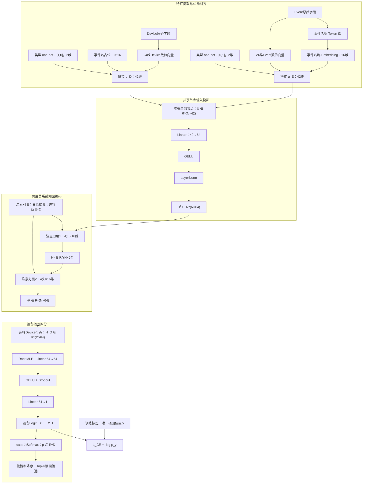

# PC-STGR 根因候选排序实现与 Stage-1 契约

> **状态更新（2026-09-02）：PC-STGR 已恢复为论文 Stage 1。**
>
> 当前论文以“PC-STGR 根因 Top-K 排序 → P0 根因条件传播图恢复”为主线，完整
> 定位以 [`论文方案.md`](./论文方案.md) 为准。本文档定义 PC-STGR 的网络结构、
> 训练目标、OOF 评价和输出接口。
>
> 现有 IC-STGR 历史结果不能直接改名为 PC-STGR 结果；论文必须使用重新运行的
> grouped OOF 指标。

## 1. 文档目的

本文档记录 PC-STGR 的方法定义、数据假设、特征工程、图结构、网络结构、向量维度、训练目标和实验约束。PC-STGR 是当前论文的根因定位阶段，其 Top-K OOF 输出是 P0/P4 传播图恢复的统一输入。

当前仓库的神经 Stage 1 代码已经迁移到 PC-STGR。现有 IC-STGR checkpoint、OOF 预测和 73.58/93.71/97.48 等历史指标仍属于旧结构，不能直接改名为 PC-STGR 结果。PC-STGR 必须重新进行分组 OOF 训练和评价。

## 2. 本轮已确定的设计决策

| 编号 | 决策 | 结论 |
| ---: | --- | --- |
| 1 | 方法名称 | **PC-STGR：Path-Conditioned Spatio-Temporal Graph Ranker，路径条件化时空图排序器** |
| 2 | 方法角色 | 根据异常路径、拓扑和事件时序输出设备级根因 Top-K |
| 3 | 图节点 | 只使用 Device、Event 两类节点 |
| 4 | 图关系 | 使用 8 类有向物理、归属和时间关系 |
| 5 | 路径条件 | 直接写入 Device 的端点锚点、端点距离和路径走廊特征 |
| 6 | 数值特征 | Device、Event 对齐为统一 24 维稀疏数值向量 |
| 7 | 节点类型 | 使用固定 2 维 one-hot：Device=`[1,0]`，Event=`[0,1]` |
| 8 | 事件名称 | 事件名称作为 Token，使用 16 维可学习 Embedding |
| 9 | 节点输入 | `24维数值 + 2维类型 + 16维事件名称 = 42维` |
| 10 | 隐藏维度 | 42 维输入经共享投影变为 64 维 |
| 11 | 图编码器 | 2 层关系感知多头图注意力，4 头，每头 16 维 |
| 12 | 标签假设 | 每个 case 只有一个真实根因设备 |
| 13 | 主损失 | case 内单根因 Softmax 交叉熵，不使用多正例目标 |
| 14 | 困难负例 | 第一版不加入；后续仅作为独立损失消融 |
| 15 | 数据规模 | 当前 159 个 case，预计扩充至约 300 个 case |
| 16 | 小样本策略 | 结构保持紧凑，类型不用可学习 Embedding，事件 Embedding 先用 16 维 |
| 17 | 评价方式 | 分组 5-fold OOF；报告 Top-1、Top-3、Top-5 和 MRR |

## 3. 方法定义

PC-STGR 的完整名称为 **Path-Conditioned Spatio-Temporal Graph Ranker**。它面向 Pingmesh 异常根因定位，把候选设备、设备事件、物理拓扑、源—目的路径位置和事件时间顺序构造成 Device–Event 时空异构图，再直接学习当前 case 内的设备根因排序。

给定一个故障 case，输出：

```text
R⁰ = [(r₁, s₁), (r₂, s₂), ..., (rₖ, sₖ)]
```

其中：

- `rᵢ` 是第 `i` 个候选根因设备；
- `sᵢ` 是该设备在当前 case 内的根因概率；
- `K` 是向后续阶段保留的候选数。

PC-STGR 回答：

> 综合设备在异常源—目的路径中的位置、设备告警、相邻设备状态和事件时间顺序，哪台设备最可能是本次故障的唯一根因？

PC-STGR 是本文 Stage 1 的根因候选排序器。论文可以将其作为完整两阶段系统的根因定位组件，但不应把常规多头注意力本身包装为新的通用机制；方法贡献应落在路径条件化时空表示、Top-K 与传播图阶段的衔接及端到端验证上。

## 4. 输入与标签假设

### 4.1 Case 级输入

| 输入 | 主要字段 | 用途 |
| --- | --- | --- |
| Pingmesh 上下文 | `alarm_time` | 事件窗口和相对时间参考 |
| 异常端点 | `source_ip`、`sink_ip` | 识别端点锚点、计算距离和路径走廊 |
| 实验分组信息 | `alarm_name`、`source_az`、`sink_az` | grouped OOF 分组，避免相似 case 泄漏 |
| 设备信息 | `ip`、`mgmt_ip`、`name`、`role`、`cross` | 设备标识和设备特征 |
| 物理拓扑 | `linked_from`、`linked_to` | Device–Device 边和拓扑距离 |
| 事件 | `alarms`、`logs` | Event 节点及时间关系 |

### 4.2 单根因标签

每个 case 只有一个真实根因设备。设当前 case 有 `D` 台候选设备，真实根因在候选数组中的位置为：

```text
y ∈ {0, 1, ..., D-1}
```

标签只用于训练损失和离线评价，不能进入节点特征、边特征或推理构图。

## 5. 预处理与路径条件

### 5.1 事件窗口

以 Pingmesh 参考时刻 `t₀` 为中心，默认保留前后 30 分钟的事件：

```text
|tₑ - t₀| ≤ 1,800,000 ms
```

### 5.2 事件去重

同一设备上名称和来源相同、相邻时间不超过 60 秒的事件合并。合并时：

- 重复次数累加；
- 严重度取最大值；
- 事件权重取最大值；
- active/clear 标志取并集。

### 5.3 图规模限制

默认：

- 每台设备最多 16 个事件；
- 每个 case 最多 1024 个事件；
- 事件过多时依次优先保留权重高、严重度高、距参考时刻近的事件。

### 5.4 端点锚点

根据设备 IP、管理 IP、名称、`linked_from`、`linked_to` 和 `node_sign`，识别源端锚点集合 `Aₛ` 与目的端锚点集合 `Aₜ`。

### 5.5 端点距离

在物理拓扑的无向视图上执行 BFS，得到设备 `v` 到源端和目的端锚点的最短跳数：

```text
dₛ(v), dₜ(v)
```

转换为连续特征：

```text
Dist(d) = 1 / (1 + d)
```

不可达时取 0。

### 5.6 路径走廊

设源端到目的端最短距离为 `L`，默认松弛 2 跳。如果：

```text
dₛ(v) + dₜ(v) ≤ L + 2
```

则设备 `v` 位于本次异常路径走廊中。

## 6. Device–Event 图结构

每个 case 构造一张图：

```text
G = (V_D ∪ V_E, E)
```

- `V_D`：Device 节点；
- `V_E`：Event 节点；
- `E`：物理、归属和时间关系边。

设：

- `D` 为 Device 数；
- `M` 为 Event 数；
- `N = D + M` 为总节点数；
- `E` 为有向边数。

### 6.1 八类有向关系

| ID | 关系 | 含义 |
| ---: | --- | --- |
| 0 | Physical Forward | 物理拓扑正向 |
| 1 | Physical Reverse | 物理拓扑反向 |
| 2 | Event → Device | 事件向所属设备注入证据 |
| 3 | Device → Event | 设备上下文影响事件表示 |
| 4 | Temporal Next | 同设备早事件到晚事件 |
| 5 | Temporal Previous | 同设备晚事件到早事件 |
| 6 | Neighbor Earlier → Later | 相邻设备间早事件到晚事件 |
| 7 | Neighbor Later → Earlier | 相邻设备间晚事件到早事件 |

同设备时间边只连接时间上相邻的事件。跨设备时间边只在物理相邻设备之间建立，默认要求时间差不超过 10 分钟，每条物理链路最多选择 4 对时间最接近的事件。

### 6.2 两维边特征

边数值特征为：

```text
x_edge = [signed_time_lag, absolute_time_lag] ∈ R²
```

对时间边：

```text
signed_time_lag   = tanh(Δt / 600,000)
absolute_time_lag = min(|Δt| / 600,000, 1)
```

反向时间边翻转第一维符号，第二维保持不变。物理边和 Event–Device 归属边使用 `[0,0]`，由关系 ID 区分语义。

## 7. 统一 24 维节点数值特征

Device 和 Event 使用同一个 24 维数值空间，但占用不同区域：

```text
维度 0–8：Event 数值特征区域
维度 9–23：Device 数值特征区域
```

```text
Event  = [事件特征 0–8 | 15 个 0]
Device = [9 个 0       | 设备特征 9–23]
```

### 7.1 公共转换函数

计数归一化：

```text
Count(x) = min(log(1 + max(x, 0)) / 8, 1)
```

拓扑距离归一化：

```text
Dist(d) = 1 / (1 + d)
```

不可达时为 0。

事件相对时间：

```text
Δt = tₑ - t₀
SignedTime(Δt) = tanh(Δt / 600,000)
AbsoluteTime(Δt) = min(|Δt| / 1,800,000, 1)
```

### 7.2 完整维度对齐表

| 维度 | 名称 | Device 节点 | Event 节点 |
| ---: | --- | --- | --- |
| 0 | `has_timestamp` | 0 | 有合法时间戳为 1，否则 0 |
| 1 | `signed_time_offset` | 0 | `SignedTime(tₑ-t₀)` |
| 2 | `absolute_time_distance` | 0 | `AbsoluteTime(tₑ-t₀)` |
| 3 | `severity` | 0 | `clip(level/4, 0, 1)` |
| 4 | `is_alarm` | 0 | alarm 为 1，log 为 0 |
| 5 | `is_active` | 0 | active/occurred/down/fault 为 1 |
| 6 | `is_clear` | 0 | clear/resume/recovered/up 为 1 |
| 7 | `event_weight` | 0 | `clip(weight/100, 0, 1)` |
| 8 | `duplicate_count` | 0 | `Count(重复次数)` |
| 9 | `role_leaf` | Leaf 为 1 | 0 |
| 10 | `role_spine` | Spine 为 1 | 0 |
| 11 | `role_core` | Core 为 1 | 0 |
| 12 | `role_other` | 其他角色为 1 | 0 |
| 13 | `normalized_indegree` | `Count(物理入度)` | 0 |
| 14 | `normalized_outdegree` | `Count(物理出度)` | 0 |
| 15 | `normalized_cross` | `Count(cross)` | 0 |
| 16 | `alarm_count` | `Count(原始告警数)` | 0 |
| 17 | `log_count` | `Count(原始日志数)` | 0 |
| 18 | `is_source_anchor` | 源端锚点为 1 | 0 |
| 19 | `is_sink_anchor` | 目的端锚点为 1 | 0 |
| 20 | `source_distance` | `Dist(dₛ)` | 0 |
| 21 | `sink_distance` | `Dist(dₜ)` | 0 |
| 22 | `in_path_corridor` | 位于路径走廊为 1 | 0 |
| 23 | `is_endpoint_anchor` | 源端或目的端锚点为 1 | 0 |

如果 Event 没有合法时间戳，则第 0、1、2 维为 `[0,0,0]`。如果事件恰好发生在参考时刻，则为 `[1,0,0]`，借助第 0 维区分“时间缺失”和“时间差为零”。

## 8. 节点类型与事件名称表示

### 8.1 节点类型使用固定 one-hot

```text
Device = [1,0]
Event  = [0,1]
```

选择固定 one-hot 的原因：

1. 当前只有两种节点类型，2 维 one-hot 已经无损表达类型；
2. 当前只有 159 个 case，分组 5 折时每折训练约 127 个 case；扩充到 300 个 case 后每折训练约 240 个 case，仍属于小样本；
3. 24 维数值空间已经按节点类型分区，one-hot 只提供低成本显式类型标志；
4. 类型没有复杂相似性，不需要专门学习类型 Embedding 空间；
5. one-hot 比 `Device=0/Event=1` 的单标量更对称、更容易解释；
6. 两套独立 Device/Event 编码器会增加参数量，第一版不采用。

### 8.2 事件名称 Token 与 Embedding

事件名称规范化后作为一个完整 Token：

```text
" LinkDown_ACTIVE " → "linkdown_active" → Token ID
```

特殊 Token：

- `<pad>`：ID 0；Device 使用该 ID，其事件名称 Embedding 为全零；
- `<unk>`：ID 1；推理时未登录事件映射到该 ID。

事件名称使用 16 维可学习 Embedding：

```text
E_event ∈ R^(|Vocab|×16)
```

当前小样本下建议词表先控制在 128–256 个高频事件；是否扩大到 512 由 OOF 结果决定。

## 9. 42 维节点输入

### 9.1 Device 输入

```text
u_D = [x_D^24 ; 1,0 ; 0^16] ∈ R^42
```

| 区间 | 维度 | 内容 |
| --- | ---: | --- |
| `u_D[0:24]` | 24 | Device 数值特征 |
| `u_D[24:26]` | 2 | 类型 `[1,0]` |
| `u_D[26:42]` | 16 | 全零事件名称占位 |

### 9.2 Event 输入

```text
u_E = [x_E^24 ; 0,1 ; e_name^16] ∈ R^42
```

| 区间 | 维度 | 内容 |
| --- | ---: | --- |
| `u_E[0:24]` | 24 | Event 数值特征 |
| `u_E[24:26]` | 2 | 类型 `[0,1]` |
| `u_E[26:42]` | 16 | 事件名称 Embedding |

所有节点堆叠后：

```text
U ∈ R^(N×42)
```

## 10. 网络结构与向量变化



### 10.1 完整维度链路

```text
原始字段
→ 24维节点数值向量
→ 拼接2维类型one-hot和16维事件名称表示
→ 42维节点输入
→ Linear 42→64
→ H⁰：N×64
→ Attention 1：N×64
→ H¹：N×64
→ Attention 2：N×64
→ H²：N×64
→ 选择Device：D×64
→ Root MLP：D×64→D×1
→ Logit：D
→ Softmax概率：D
→ Top-K：K
```

### 10.2 图输入张量

| 张量 | 形状 | 含义 |
| --- | ---: | --- |
| `node_input` | `N×42` | Device/Event 对齐后的节点输入 |
| `edge_sources` | `E` | 边起点 |
| `edge_targets` | `E` | 边终点 |
| `edge_types` | `E` | 8 类关系 ID |
| `edge_features` | `E×2` | 时间边数值特征 |
| `device_indices` | `D` | Device 在节点数组中的位置 |
| `root_position` | 标量 | 训练时唯一根因位置 `y` |

## 11. 关系感知多头注意力

默认：

```text
hidden_dim = 64
heads = 4
head_dim = 16
layers = 2
```

对一条有向边 `u --r,e→ v`：

```text
q_v = W_Q h_v
k_u,r,e = W_K h_u + Emb_K(r) + W_EK e
m_u,r,e = W_V h_u + Emb_V(r) + W_EV e
```

每个头计算：

```text
a_u→v = (q_v · k_u,r,e) / sqrt(16) + b_r + b_e
```

对同一目标节点、同一注意力头的所有入边执行 softmax：

```text
α_u→v = softmax_v(a_u→v)
```

聚合：

```text
message_v = Σ α_u→v · m_u,r,e
```

内部维度变化：

```text
Hˡ：N×64
→ 按E条边选源/目标：E×64
→ 拆分4个头：E×4×16
→ 点积注意力：E×4
→ 加权消息：E×4×16
→ 按目标节点聚合：N×4×16
→ 拼接4个头：N×64
→ 输出投影、残差、LayerNorm：N×64
→ FFN 64→128→64、残差：Hˡ⁺¹，N×64
```

两层传播后，设备主要获得：

- 自身事件证据；
- 物理邻居状态；
- 相邻设备已经聚合的事件证据；
- 设备内和跨设备事件时间模式；
- 自身在源—目的路径中的全局坐标特征。

## 12. 单根因评分与损失

图编码结束后只选择 Device：

```text
H_D ∈ R^(D×64)
```

Root MLP：

```text
64 → 64 → 1
```

得到：

```text
z = [z₁, z₂, ..., z_D] ∈ R^D
```

case 内 softmax：

```text
p_i = exp(z_i) / Σ_j exp(z_j)
```

唯一真实根因位置为 `y`，主损失：

```text
L_CE = -log p_y
     = logsumexp(z) - z_y
```

这是 case 内单根因 Softmax 排序损失。虽然使用交叉熵形式，但不同 case 的候选设备集合不同，它学习的是“当前 case 中真实根因分数高于其他设备”，不是跨 case 的固定设备类别分类。

第一版主实验只使用 `L_CE`。可选困难负例损失仅作为后续消融：

```text
L_pair = mean softplus(z_n - z_y)
L = L_CE + λ L_pair
```

不得把该可选项写成主模型既定组成部分，除非 OOF 实验明确选择它。

## 13. 小样本训练策略

当前共有 159 个 case，预计扩充到约 300 个。图中节点很多，但监督信号仍是 case 级的唯一根因，因此不能把节点数当作独立监督样本数。

分组 5-fold 时：

- 159 个 case：每折训练约 127 个，验证约 32 个；
- 300 个 case：每折训练约 240 个，验证约 60 个。

推荐首版配置：

| 配置 | 建议值 |
| --- | ---: |
| 数值特征 | 24 |
| 类型 one-hot | 2 |
| 事件名称 Embedding | 16 |
| 节点输入 | 42 |
| 隐藏维度 | 64 |
| 注意力头 | 4 |
| 每头维度 | 16 |
| 图层数 | 2 |
| FFN 中间维度 | 128 |
| Dropout | 0.20–0.30 |
| 事件词表 | 128–256 起步 |
| 主损失 | 单根因交叉熵 |
| 模型选择 | 验证集 MRR |

如果出现明显过拟合，优先尝试：

1. 隐藏维度从 64 降到 32；
2. 事件名称 Embedding 从 16 降到 8；
3. 缩小事件词表；
4. Dropout 从 0.2 提高到 0.3；
5. 增加适度权重衰减；
6. 更早停止训练。

节点类型 one-hot 只有 2 维，不是主要过拟合来源，不应作为第一优先删除对象。

## 14. 训练、OOF 与评价

### 14.1 分组 5-fold OOF

分组签名至少包含：

```text
source endpoint
sink endpoint
alarm name
source AZ
sink AZ
```

重复或高度相似的端点故障必须进入同一 fold。每一折的事件词表只能用该折训练 case 建立。

### 14.2 评价指标

设唯一真实根因的排名为 `rank_y`：

```text
Top-1 = 1(rank_y ≤ 1)
Top-3 = 1(rank_y ≤ 3)
Top-5 = 1(rank_y ≤ 5)
RR = 1 / rank_y
MRR = 所有case的RR均值
```

建议同时报告：

- normalized entropy；
- Top-1/Top-2 概率 margin；
- 3–5 个随机种子的均值与标准差；
- 按设备数、事件数和拓扑直径分组的误差分析。

## 15. 推理与输出契约

推理不读取根因标签：

```text
加载checkpoint和事件词表
→ 无标签构图
→ 图编码
→ Device logits
→ case内softmax
→ Top-K
```

推荐方法标识：

```text
path-conditioned-spatiotemporal-graph-ranker-v1
```

输出示例：

```json
{
  "initial_root_rankings": [
    {
      "rank": 1,
      "ip": "D1",
      "combined_score": 0.68,
      "neural_score": 0.68,
      "logit": 2.13
    }
  ],
  "stage1": {
    "method": "path-conditioned-spatiotemporal-graph-ranker-v1",
    "model_name": "PC-STGR",
    "evaluation_mode": "out_of_fold"
  }
}
```

兼容字段 `Stage 1` 中的 `combined_score` 与 `neural_score` 都是 PC-STGR 的 case 内概率。该输出接口仅用于向传播图流水线提供可替换候选。

## 16. 必做消融

| 消融 | 改动 | 目的 |
| --- | --- | --- |
| 无类型标志 | 删除 2 维 one-hot | 验证24维分区和关系类型是否已足够 |
| 类型 Embedding | 用 4 维可学习类型 Embedding 替代 one-hot | 比较固定类型与可学习类型表示 |
| 无跨设备时间边 | 删除关系 6、7 | 验证跨设备时间传播贡献 |
| 无路径特征 | 置零 18–23 维 | 验证路径条件贡献 |
| 无事件名称 | 16 维事件 Embedding 置零 | 验证事件语义贡献 |
| 纯交叉熵 vs 困难负例 | 加入可选 pairwise 项 | 验证额外排序约束是否有效 |

所有消融必须使用相同 fold、随机种子、事件词表上限、隐藏维度和训练策略，不预设性能提升。

## 16.1 可选的自监督预训练变体

仓库额外提供 **PC-STGR-SSL**，作为不替换原 PC-STGR 的可选初始化方案。原
`PathConditionedGraphRanker`、监督训练入口和 `pc-stgr-stage1-v1` checkpoint
均保持不变；自监督变体使用独立模型、流水线和
`pc-stgr-ssl-stage1-v1` checkpoint。

预训练仍使用相同的路径条件化 Device–Event 图，但编码器看到的是扰动后的图，
通过以下无标签目标恢复原始上下文：

1. 掩码事件名称重建：将部分已知事件 token 替换为 `<unk>`，预测原事件 token；
2. 掩码数值特征重建：遮蔽部分非零节点特征，以 MSE 恢复原值；
3. 隐藏边重建：移除部分原始边，联合真实隐藏边和节点类型兼容的非边负样本，
   预测 8 类关系或“无边”。

预训练完成后保留图编码器，使用与原 PC-STGR 相同的 case 内根因排序目标进行
全参数监督微调。三个辅助头不参与推理，输出仍为 Device logits、case 内
Softmax 和 Stage 2 兼容的 Top-K。

为避免 OOF 泄漏，每个 fold 的事件词表和自监督预训练图只能来自该 fold 的训练
case。训练 case 会通过 `require_labels=False` 重新加载，并以
`include_labels=False` 构图；验证 case 不参与预训练。全量 `final_model.pt`
则在 OOF 预测全部生成之后，使用全部 case 的无标签视图预训练并监督微调，不能
回用于这些 case 的论文评分。

推荐方法标识：

```text
self-supervised-pretrained-path-conditioned-spatiotemporal-graph-ranker-v1
```

PC-STGR-SSL 必须作为独立实验行报告，不能把它的 checkpoint 或结果标为原始
PC-STGR。

## 17. 实现状态与实验清单

代码迁移已完成：

1. 图节点类型为 Device、Event 两类；
2. 关系类型为 8 类；
3. 边数值特征为 2 维；
4. 节点数值特征保持统一 24 维；
5. 节点类型使用固定 2 维 one-hot；
6. 事件名称 Embedding 默认 16 维；
7. 节点输入拼接为 42 维；
8. 输入编码器为 `Linear(42,64) → GELU → LayerNorm`；
9. 标签结构为单一 `root_position`；
10. 损失为单根因 case-wise cross entropy；
11. PC-STGR checkpoint 使用独立格式版本并保存图、词表和模型配置；
12. 输出元数据使用 PC-STGR 方法标识；
13. 论文实验脚本已切换到独立的 `pc_stgr_oof` 和 `pc_stgr_stage2` 目录；
14. 训练标签读取和 `Score_N` 评测统一为每个 case 一个根因设备；
15. 新增独立的 PC-STGR-SSL 模型与无泄漏 OOF 流水线，原网络及其默认入口保持不变；
16. 兼容实验脚本可通过 `supervised` / `self_supervised` 选择候选排序变体。

仍需在服务器 PyTorch/NPU 环境完成：

1. 在目标 NPU 环境复验模型前向、损失和 checkpoint 往返；
2. 分别重新执行 PC-STGR 与 PC-STGR-SSL grouped 5-fold OOF；
3. 生成两种方案各自的 Top-1/Top-3/Top-5/MRR；
4. 将两种 PC-STGR 新结果与历史 IC-STGR 结果分开报告。

## 18. 方法边界

- 两层图注意力主要传播局部动态证据，远距离事件依赖可能不足；
- 路径条件依赖物理拓扑和端点映射质量；
- 时间关系依赖事件时间戳质量；
- 小样本下事件词表过大可能导致稀疏和过拟合；
- `<unk>` 事件只能依赖数值特征和图上下文；
- PC-STGR 结果必须来自自身训练，不能沿用其他网络结构的 checkpoint 或指标。

## 19. 一句话定义

> PC-STGR 以 Pingmesh 异常源—目的路径为条件，将候选设备、设备事件、物理邻接和事件时间顺序构造成 Device–Event 时空异构图，把 `24维数值特征 + 2维固定类型 one-hot + 16维事件名称 Embedding` 拼接为 42 维节点输入，经两层关系感知多头图注意力得到 64 维设备表示，并使用 case 内单根因 Softmax 交叉熵学习根因排序，最终输出高召回的 Top-K 设备候选。
