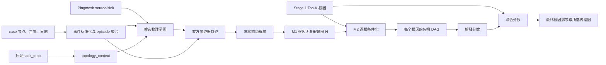

# Stage 2：M1 与 M2 当前实现说明

> 记录日期：2026-08-24
>
> 对应配置版本：`two-stage-v1`
>
> 文档性质：以 `2stage` 分支当前代码为准的实现说明，不把尚未落地的目标策略写成既有能力。

## 1. Stage 2 解决什么问题

Stage 1 输出一个根因设备候选序列及其分数，但这个序列不能直接说明故障如何传播。Stage 2 的任务分为两个模块：

- **M1：根因无关的假设传播图重建。** 从原始拓扑、告警、日志和时间信息出发，为候选拓扑中的每个相邻设备对计算三种互斥状态的概率；M1 不读取 Stage 1 候选及其分数。
- **M2：根因条件化的传播 DAG 求解与根因重排。** 将每个 Stage 1 候选分别作为根节点，在同一张 M1 图上筛边、搜索传播路径、合并为 DAG，再用传播解释分数辅助重排。

这种拆分避免了“先假定某个根因，再围绕它构图，最后用这张图证明该根因”的循环论证。所有根因候选共享同一个 M1 输出，差异只发生在 M2 的根因条件化阶段。



## 2. 输入、输出与不变量

### 2.1 输入

每个 case 的 Stage 2 输入包括：

1. `info.json`：告警时间、Pingmesh source/sink 等事件级信息；
2. case 节点文件：设备、告警、日志以及兼容字段；
3. `topology_context.json`：由对应原始 `full_link.task_topo.value` 生成的拓扑 sidecar；
4. Stage 1 `initial_root_rankings`：仅由 M2 使用；
5. 可选的 P4 OOF 边分类器模型。

运行时 M1、M2 均不读取根因标签或传播路径标签。P4 的训练脚本是唯一允许读取 `propagation_label.json` 的路径。

### 2.2 核心不变量

- M1 对同一 case 只构建一张图，并且不读取 Stage 1 排名。
- M1 只评价候选拓扑中已有的相邻设备对；告警文本中的 peer 不能创建新拓扑边。
- 没有来源为 `raw_task_topo` 的 context 时，候选节点仍可保留，但候选边全部清空。
- M2 的输出边必须同时匹配候选图的节点对和 `topology_edge_ids`。
- M2 的主传播图必须无环，并且所有保留节点从候选根可达。

这里的“原始拓扑硬约束”目前严格指：节点对出现在 `task_topo.links` 并能关联到 sidecar 中的 `topology_edge_id`。它保证结果边不会脱离该原始边表，但尚不能证明该 link 一定是经过独立物理资源台账确认的 L1 直连，详见第 9 节。

## 3. M1：根因无关假设传播图

M1 的执行入口是 `reconstruct_hypothesis_graph`，顺序为：

1. 将告警与日志标准化为 evidence episode；
2. 根据原始拓扑、端点和异常设备裁剪候选子图；
3. 对每个候选相邻设备对分别计算两个传播方向的证据；
4. 将两个方向与“无直接传播”归一化为三状态概率；
5. 输出一张根因无关的 `hypothesis_graph`。

### 3.1 告警与日志标准化

每条原始告警或日志先被规范化为统一事件，主要字段包括：

- `device_id`、`source_type`；
- `event_type`、`fault_layer`；
- `timestamp_ms`；
- 从描述中解析出的接口 `object` 和 `peer_device`；
- `observation_scope`：`local`、`remote` 或 `unknown`；
- `lifecycle`：发生或清除；
- 可回溯到原始记录的 `raw_evidence_id`。

规则会识别物理链路 Down/Up、接口 Down、BGP/BFD 会话 Down、LLDP 邻居变化、路由变化、配置变化和设备健康事件；不能识别的记录统一记为 `generic_event`。

随后，系统按以下键聚合重复记录：

```text
(device_id, event_type, object, peer_device, observation_scope)
```

相邻记录在 `dedup_window_ms=60,000` 毫秒内合并；清除记录会和之前的活动记录组成一个发生—恢复 episode。episode 的开始时间不是单点，而是相对 case 告警时间的区间：

```text
[onset_offset - timestamp_uncertainty_ms,
 onset_offset + timestamp_uncertainty_ms]
```

默认时间不确定度为 5 秒。episode 的 `incident_relevance` 当前按规则累计：

- 基础值 `0.15`；
- 非 `generic_event` 加 `0.45`；
- 位于 case 的 ±5 分钟窗口内加 `0.30`；
- 显式解析到 peer 再加 `0.10`；
- 全部为清除事件时，最终相关度乘 `0.35`；
- 最终截断到 `[0,1]`。

### 3.2 受影响目标集合

M1 的传播目标不由某个候选根决定，而是全局统一选取：

- Pingmesh source/sink 对应的拓扑锚点以 `target_prize=1.0` 加入目标池；
- `incident_relevance >= 0.45` 且不是纯清除事件的设备作为异常目标；
- 同时是端点和事件设备时合并为一个目标；
- 全部目标按 `target_prize` 降序，默认最多保留 10 个；因此锚点数量本身超过上限时也会发生确定性截断。

### 3.3 候选拓扑子图

候选子图由下列节点集合的并集构成：

1. source 到 sink 的近最短路径走廊：

   ```text
   dist(source, v) + dist(v, sink)
   <= shortest(source, sink) + corridor_slack_hops
   ```

   默认 `corridor_slack_hops=2`。

2. 端点、异常目标和相关事件设备周围默认 1 hop 的 incident neighborhood；
3. source/sink、异常目标和相关事件设备之间的确定性最短路连接节点；
4. 所有必须保留的端点、目标和连接节点。

普通候选节点默认上限为 80，但必须节点不会因为上限而丢失，所以极端 case 的最终候选数可能超过 80。

候选边只来自所选节点间的 `topology_context.edges`。每条边保留：

- 两端设备；
- 原始 `topology_edge_ids`；
- 原始端口；
- topology group/segment；
- 是否位于 source–sink 走廊；
- 是否存在显式 peer 证据。

### 3.4 每个方向的证据得分

对无向相邻设备对 `{a,b}`，M1 分别建立 `a→b` 和 `b→a` 两个方向假设。每个方向使用三类正证据和一个反证项。

#### 3.4.1 时间先后证据 `T`

取上下游设备最早的活动 episode 区间。若上游区间为 `[u_l,u_h]`，下游区间为 `[v_l,v_h]`，传播时延区间为：

```text
lag = [v_l - u_h, v_h - u_l]
```

允许最多 30 秒的负时延容忍和最多 10 分钟的传播时延。完全超出范围时 `T=0`，同时产生 `0.65` 的时间反证；区间可接受时，越接近零时延得分越高。任一端没有时间信息时 `T=0`，但不会仅因缺时间产生反证。

#### 3.4.2 告警语义证据 `S`

当前主要规则为：

| 上游事件 | 下游事件 | `S` | 关系类型 |
| --- | --- | ---: | --- |
| 物理链路/接口 Down | BGP、BFD、LLDP 或路由变化 | 1.00 | `routing_convergence` |
| 物理链路/接口 Down | 物理链路/接口 Down | 0.45 | `physical_link` |
| 路由派生事件 | 物理链路/接口 Down | 0 | 产生 0.65 反证 |
| 其他组合 | 其他组合 | 0 | `inferred_impact` |

#### 3.4.3 显式设备关系证据 `D`

如果告警文本显式指向邻居，则结合 `local/remote` 语义判断方向：

- 与方向一致且 scope 明确时得分 `1.0`；
- 方向一致但 scope 不明确时得分 `0.8`；
- local/remote 语义与假设方向相反时产生最高 `0.9` 的反证。

#### 3.4.4 原始方向分数

三个证据与最大反证 `C` 合成为：

```text
s(a→b) = clip(
    0.35 * T
  + 0.35 * S
  + 0.30 * D
  - 0.35 * C,
  0, 1)
```

拓扑只决定“这个设备对是否允许评价”，不进入传播概率加分，避免仅凭相邻就制造传播证据。

### 3.5 “无直接传播”支持度

对每个节点对还计算 `inactive_support`：

- 两端都没有 episode：基础值 `1.0`；
- 只有一端有 episode：基础值 `0.75`；
- 两端都有 episode：基础值为 `(1-S_max)(1-D_max)×0.25`；
- 再加 `0.35×C_max`，最终截断到 `[0,1]`。

它表示“这条物理候选边在当前事件中未发生可观测直接传播”，而不是表示物理链路不存在。

### 3.6 三种边概率方案

三种方案输出相同的互斥状态：

```text
P(a→b), P(b→a), P(no_direct_propagation)
```

三者和为 1。若概率并列，`no_direct_propagation` 在最终 preferred state 选择时优先。

#### P0：`deterministic_evidence_v1`

直接将两个方向原始分数和 `inactive_support` 做非负归一化：

```text
p = normalize([s(a→b), s(b→a), inactive_support])
```

如果三项全为零，则退化成均匀分布。P0 不训练，适合作为确定性基线。

#### P1：`logit_softmax_v1`

P1 先构造固定权重 logit，再经过带温度的 Softmax。默认方向 logit 为：

```text
z_dir = -1.50
      + 1.50 * temporal
      + 2.00 * semantic
      + 1.50 * direct
      - 2.00 * contradiction
      + relation_bias
```

关系偏置分别为：

- `routing_convergence`: `+0.25`；
- `physical_link`: `0.00`；
- `inferred_impact`: `-0.25`。

无直接传播的 logit 为：

```text
z_none = -0.25
       + 2.50 * inactive_support
       + 0.50 * (1 - max_semantic_or_direct_support)
```

然后计算：

```text
p_i = softmax(z_i / temperature),  temperature=1.0（默认）
```

如果两个方向都没有任何时间、语义或直接关系动态证据，P1 不执行普通 Softmax，而是强制输出 `[0,0,1]`，即完全选择无直接传播。

#### P4：`supervised_softmax_v1`

P4 是类别加权的三分类多项逻辑回归。它使用 23 维根因无关特征：

- forward 方向 10 维：原始分数、时间、语义、直接关系、反证、时间是否可用、证据数量和三类关系 one-hot；
- reverse 方向对应的 10 维；
- `inactive_support`；
- 正反方向原始分数差；
- 是否存在任意动态传播证据。

传播标签中的 `definite` 和 `possible` 有向边作为对应方向正类；其余候选对作为 `no_direct_propagation`。双向同时为正的歧义样本被跳过。训练时交换 forward/reverse 做方向增强，并交换对应标签。

P4 的数据隔离方式为：

1. 以 source、sink、alarm name、source AZ、sink AZ 组成 incident group；
2. 外层按 group 划分 OOF 训练折与测试折；
3. 外层训练数据内部再按 group 留出开发折，用于选择 epoch 和温度；
4. 选定超参数后在完整外层训练折重训；
5. 每个有标签测试 case 只能使用未见过该 case/group 的折模型；
6. 无传播标签的 case 可以使用全部有标签 case 训练的 final model，因为它没有向该训练集泄漏自身路径标签。

和 P1 一样，P4 遇到完全没有动态传播证据的设备对时也强制输出 `[0,0,1]`。

### 3.7 M1 输出

M1 输出 `hypothesis-graph-v1`，主要包括：

- `nodes`：候选设备及其走廊位置、距离、目标标记和证据 ID；
- `candidate_topology_edges`：允许进入 M2 的原始拓扑边；
- `edge_hypotheses`：每个节点对的双方向证据、三状态概率、熵和 preferred state；
- `affected_targets`：所有根因候选共同解释的目标；
- `evidence_map`：episode ID 到原始证据的映射；
- `summary/diagnostics`：候选规模、概率方法、拓扑来源等。

M1 输出允许存在方向竞争和环形候选。它不是最终 DAG，也不直接决定根因排名。

## 4. M2：根因条件化传播 DAG 与重排

M2 对 Stage 1 Top-K 中的每个候选根因独立执行同一套求解过程。

### 4.1 根因假设标准化

Stage 1 条目被转换为：

```json
{
  "hypothesis_id": "R1",
  "root_scope": "device",
  "root_devices": ["device_ip"],
  "rank": 1,
  "support_score": 0.0
}
```

当前运行路径只构造单设备根因假设。Stage 1 分数依次尝试读取 `combined_score`、`stage1_score`、`score`、`support_score`、`pr_score`，并截断到 `[0,1]`；没有分数时使用 `1/rank`。

### 4.2 根因条件化筛边

对于候选根因 `r`，先在 M1 候选无向拓扑上计算 hop 距离 `d_r(v)`。方向 `u→v` 只有同时满足以下条件才可进入路径搜索：

1. 该节点对的 M1 `topology_edge_ids` 与候选拓扑边 ID 存在交集；
2. `d_r(v) > d_r(u)`，即传播方向严格远离根因；
3. `P(u→v) > P(no_direct)`；
4. `P(u→v) >= min_edge_support`，默认阈值为 `0.25`。

满足条件的方向按概率分级：

- `strong`：`p >= 0.60`；
- `moderate`：`0.40 <= p < 0.60`；
- `weak`：`0.25 <= p < 0.40`；
- 其他方向为 `rejected`。

进入求解器前还会再次根据“节点对 + topology ID 交集”校验一次，防止中间结构被错误拼接。

严格要求 `d_r(v) > d_r(u)` 会删除同层横向边，也天然阻止指向根因的反向边。

### 4.3 逐目标束搜索

M2 对每个 affected target 分别从根因执行有向束搜索：

- 最大路径深度：8；
- 每层 beam width：32；
- 每个目标最多保留 3 条路径；
- 同一路径内不允许节点重复。

一条非空路径 `π` 的得分为：

```text
score(π) = clip(
    0.40 * min_edge_probability
  + 0.35 * mean_edge_probability
  + 0.15 * target_prize
  + 0.10 * grounded_edge_ratio
  - 0.02 * (edge_count - 1)
  - 0.20 * max_contradiction,
  0, 1)
```

因此路径评分同时关注最弱边、平均边质量、目标重要性、证据 grounding、路径复杂度和反证。若根因本身就是目标，则产生零跳路径；它可以覆盖该目标，但不会增加传播边概率解释量。

### 4.4 路径合并为 DAG

主图先取每个目标得分最高的路径，再按路径得分从高到低合并：

- 已存在的同向边会复用；
- 加入一条路径会导致有向环时，整条路径不加入；
- 当前 `alternative_group` 默认为空，但求解器保留了互斥替代组接口；
- 最终节点分为 `root`、`affected` 和 `propagation`；
- 每条输出边重新编号为 `P1...Pn`，同时保留 M1 hypothesis ID、拓扑 ID 和 evidence ID。

然后，对每个目标尝试用其第二、第三路径替换主路径，构造最多 3 个不同边集的 `alternative_hypotheses`。全局还保留最多 10 条 `ranked_chains` 作为路径候选摘要。

### 4.5 根因解释分数

M1 中某个节点对只有在其最大方向概率高于 `P(no_direct)` 时，才计入全局有效关系权重：

```text
w(e) = max(P(a→b), P(b→a)),  if max_direction > P(no_direct)
       0,                    otherwise
```

解释分母是所有 M1 有效关系权重之和：

```text
Denominator = Σ_e w(e)
```

候选根因 `r` 的解释分子是其最终传播 DAG 中所选方向的概率之和：

```text
Numerator(r) = Σ_(u→v in D_r) P(u→v)
```

最终解释分数为：

```text
E(r) = clip(Numerator(r) / Denominator, 0, 1)
```

分母对所有根因相同，因而比较的是每个根因在相同 M1 关系总量下能够组成合法、根可达传播图的比例。当前分母包含整个 M1 候选图中方向胜过 no-direct 的关系，即使某些关系对某个根因不可达，也仍然保留在共同分母中。

### 4.6 Stage 1 与解释分数融合

对所有候选分别做最大值归一化：

```text
S1_norm(r) = S1(r) / max_r S1(r)
E_norm(r)  = E(r)  / max_r E(r)
```

有足够路径证据时，最终分数为：

```text
Final(r) = α * S1_norm(r) + (1-α) * E_norm(r)
```

默认 `α=0.50`。最终按 `Final` 降序；分数相同时保持 Stage 1 初始名次，再以 hypothesis ID 确定性排序。

当前代码对“有足够路径证据”的判定只有：

```text
Denominator > 0
且至少一个候选根因生成了非空传播边
```

如果不满足，所有候选只使用 `S1_norm`，因此顺序完全回退 Stage 1。

## 5. 可信度与 diagnosability

M2 选出最终 Top-1 后，系统对该根因对应的传播图执行可信度评估。主要统计包括：

- topology ID 是否有效；
- 是否为 DAG；
- 所有节点是否从根因可达；
- 目标覆盖率；
- 有 evidence ID 的边比例；
- moderate/strong 边比例；
- strong 边比例；
- 主图与最优替代图的分数差；
- 是否存在方向冲突和仅弱边情况。

当前 diagnosability 定义如下。

### 5.1 `unidentifiable`

满足任一条件：

- 根因、拓扑合法性、DAG 或根可达性不成立；
- 没有目标；
- 有目标但没有边；
- 目标覆盖率小于 `0.35`；
- 所有输出边均为 weak。

### 5.2 `fully_observed`

同时满足：

- 目标覆盖率至少 `0.70`；
- 所有边均为 moderate 或 strong；
- 至少一半的边绑定了 evidence；
- 主图相对替代图的分数差至少 `0.08`，或不存在替代图；
- 不存在方向冲突。

### 5.3 `partially_observed`

结构有效且证据不至于 `unidentifiable`，但未达到 `fully_observed` 的 case。

需要特别注意：**当前 diagnosability 是最终选图之后计算的输出属性，不是 M2 重排之前的门控条件。** 因而当前实现不能保证 `unidentifiable` 一定保持 Stage 1 原始顺序。

## 6. 当前回退和重排的真实行为

| 情况 | 当前行为 |
| --- | --- |
| 没有 raw `task_topo` context | M1 候选边为空，M2 回退 Stage 1 |
| 所有边都由 P1/P4 判为无动态传播 | 三状态强制 `[0,0,1]`，M2 回退 Stage 1 |
| M1 没有任何方向概率胜过 no-direct | 分母为 0，M2 回退 Stage 1 |
| 所有候选根因均无法形成传播边 | M2 回退 Stage 1 |
| 至少一个候选形成边，但最终图随后被标记 `unidentifiable` | **当前仍可能发生重排** |
| 图覆盖率或 grounding 较低但仍形成边 | **当前仍可能发生重排** |

这与目标验收策略之间仍有差距。以下目标尚未在当前 M2 门控中落地：

- `unidentifiable` 强制保持 Stage 1 原顺序；
- 只有 `partially_observed` 或 `fully_observed` 才允许重排；
- 用覆盖率、grounding、边数和解释分数差阈值联合控制重排；
- 在开发折中搜索 Stage 1 权重和门控阈值，测试折只评估；
- 逐 case 输出 `correct→wrong`、`wrong→correct`、`unchanged` 与净修正收益；
- deterministic、neural OOF 和二者候选并集三种 Stage 2 输入的统一实验入口。

因此，阅读当前实验结果时，应把 `ranking_feedback.fallback_to_stage1` 和 `diagnosability` 看作两个不同变量，不能将二者视为同义词。

## 7. 输出文件与字段

### 7.1 `res.json`

`res.json` 保留紧凑的排序和可信度摘要：

- `initial_root_rankings`；
- `final_root_rankings`；
- `ranked_ips`、`selected_root`；
- `ranking_feedback`；
- `propagation.diagnosability`、`trust` 和 M1 summary；
- 指向 sidecar 的 `selected_path_ref`。

### 7.2 `selected_propagation_paths.json`

每个成功 case 的完整所选传播图单独保存，主要包含：

- `case_id` 和 case 路径；
- `selected_root`；
- `selected_propagation_graph.nodes`；
- `selected_propagation_graph.edges`；
- `diagnosability`、`trust` 和 `ranking_feedback`。

边上的关键可追溯字段为：

- `edge_hypothesis_id`：对应 M1 节点对假设；
- `topology_edge_ids`：对应 `topology_context.json` 中的原始拓扑边；
- `evidence_ids` 和 `counter_evidence_ids`：对应 M1 `evidence_map`；
- `state_probability`、`support_level` 和时间/语义/反证特征。

当前标准 pipeline 只把 M1 的 summary 写入 `res.json`，完整 `hypothesis_graph/evidence_map` 仍是运行期对象。sidecar 只保存最终选中根因的图；所有候选根因的 `root_conditioned_propagation_graphs` 在运行期生成，但未完整写入紧凑结果文件。

## 8. 默认参数

| 参数 | 默认值 | 作用模块 |
| --- | ---: | --- |
| `root_top_k` | 3 | M2 候选根因数 |
| `incident_neighborhood_hops` | 1 | M1 异常邻域 |
| `corridor_slack_hops` | 2 | M1 source–sink 走廊放宽 |
| `max_candidate_nodes` | 80 | M1 普通候选节点上限 |
| `max_targets` | 10 | M1 受影响目标上限 |
| `event_window_ms` | 300000 | episode 事件窗口 |
| `timestamp_uncertainty_ms` | 5000 | 时间区间半宽 |
| `negative_lag_tolerance_ms` | 30000 | 负时延容忍 |
| `max_propagation_lag_ms` | 600000 | 最大传播时延 |
| `min_edge_support` | 0.25 | M2 最低方向概率 |
| `moderate_edge_support` | 0.40 | moderate 阈值 |
| `strong_edge_support` | 0.60 | strong 阈值 |
| `max_path_depth` | 8 | M2 最大路径深度 |
| `beam_width` | 32 | M2 束宽 |
| `top_k_paths_per_target` | 3 | 每目标候选路径数 |
| `unique_hypothesis_margin` | 0.08 | trust 主/替代图差距阈值 |
| `min_target_coverage_for_partial` | 0.35 | 可识别最低覆盖率 |
| `min_target_coverage_for_full` | 0.70 | fully observed 覆盖率 |
| `stage1_weight` | 0.50 | Stage 1 与解释分数融合权重 |

## 9. 当前物理边定义的边界

当前 `topology_context` 将 `task_topo.value[*].links` 中所有合法的 `src_ip/dst_ip` 记录转成候选物理边，并保留端口与原始 edge ID。后续有两层 topology ID 交集校验，因此正常情况下 M2 不会输出完全不存在于该原始 link 表中的节点对。

但是，目前没有使用额外物理资源台账，也没有根据以下条件继续过滤：

- link 类型或采集来源；
- 两端端口是否都存在；
- 节点角色组合是否允许物理直连；
- link 是否属于本次实际转发路径，而非全量 fabric 邻接；
- 是否由 LLDP、端口资源或其他数据源交叉确认。

所以 `topology_validation="raw_edge_match"` 的准确含义是“与本 case 的原始 `task_topo.links` 匹配”，不是“已经由独立数据源证明为真实 L1 物理直连”。如果结果边在外部物理拓扑中不存在，应先利用 `topology_edge_ids` 回查 raw link：

- raw link 中也存在：问题位于 `task_topo.links → physical edge` 的定义过宽；
- raw link 中不存在：问题位于 case/context/result 对齐或旧结果复用。

## 10. 实现文件映射

| 功能 | 文件 |
| --- | --- |
| 配置和根因假设 | `Sys/RootCauseAnalyze/propagation/schema.py` |
| 事件标准化与 episode | `Sys/RootCauseAnalyze/propagation/episodes.py` |
| 候选拓扑子图 | `Sys/RootCauseAnalyze/propagation/candidates.py` |
| 双方向证据与原始得分 | `Sys/RootCauseAnalyze/propagation/scorer.py` |
| P0/P1/P4 三状态概率 | `Sys/RootCauseAnalyze/propagation/m1/probability.py` |
| M1 总编排 | `Sys/RootCauseAnalyze/propagation/m1/reconstruct.py` |
| 根因条件化和解释分数 | `Sys/RootCauseAnalyze/propagation/m2/infer.py` |
| 束搜索、DAG 合并和替代图 | `Sys/RootCauseAnalyze/propagation/solver.py` |
| diagnosability 与 trust | `Sys/RootCauseAnalyze/propagation/trust.py` |
| Stage 2 总编排 | `Sys/RootCauseAnalyze/propagation/reconstruct.py` |
| case 运行和结果写出 | `Sys/RootCauseAnalyze/propagation_pipeline.py` |
| P4 OOF 训练 | `Sys/Score/train_stage2_edge_classifier.py` |
| 有效性与路径评价 | `Sys/Score/evaluate_propagation.py` |

## 11. 简化伪代码

```text
episodes = normalize_and_group(case.alarms, case.logs)
candidate_graph = crop_raw_topology(
    topology_context,
    source_sink_anchors,
    affected_targets(episodes),
)

# M1：只运行一次，不看 Stage 1 roots
for each adjacent pair {a, b} in candidate_graph:
    evidence_ab = score_direction(a, b, episodes)
    evidence_ba = score_direction(b, a, episodes)
    p_ab, p_ba, p_none = assign_three_state_probability(
        evidence_ab, evidence_ba, inactive_support
    )
H = one_shared_hypothesis_graph(all_pairs)

# M2：每个候选根在同一个 H 上求解
denominator = effective_relation_mass(H)
for root in stage1_top_k:
    distance = bfs_distance(candidate_graph, root)
    eligible_edges = filter(
        raw_topology_match,
        distance_outward,
        p_direction > p_none,
        p_direction >= min_edge_support,
    )
    paths = beam_search_per_target(root, eligible_edges)
    D_root = merge_without_cycles(paths)
    explanation[root] = selected_probability_mass(D_root) / denominator

if denominator > 0 and any(D_root has edges):
    final_score = alpha * normalize(stage1_score)
                + (1-alpha) * normalize(explanation)
else:
    final_score = normalize(stage1_score)

selected_root = argmax(final_score)
diagnosability = assess_trust(D_selected_root)  # 当前发生在重排之后
```
