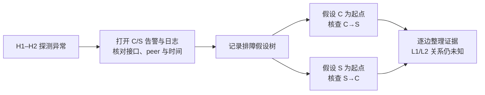

# 论文引入设计：从工程师排障场景到传播图恢复

更新：2026-09-10。用户确认暂时没有现场记录，因此本轮使用**可复核的合成工程示例**。本文档中的操作是拟定排障流程，不是已观测到的工程师行为；它不能作为用户研究、真实事故或排障效率的实证证据。

## 1. 选用哪个 case，为什么

使用仓库标注工具内的 [DEMO_001 观测](../../../pingmesh-propagation-labeler/examples/demo_cases/DEMO_001/nodes.json)及其[触发信息](../../../pingmesh-propagation-labeler/examples/demo_cases/DEMO_001/info.json)。示例包含端到端丢包、设备接口告警、邻居会话变化以及没有事件记录的设备，足以展示“得到根排名以后还要做什么”。设备以 C、S、L1、L2 和 H1、H2 表示；不引用真实 IP、客户名、事故时间或业务损失。

只使用 `info.json` 和 `nodes.json` 中的观测。`demo_predictions.json` 是旧原型的人工构造输出，包含观测文件没有的 L2 路由撤回事件及示意分数，**不能作为引入的证据或标签**。这里不运行模型，也不将图示称为算法实际输出。

| 工程师能看到的内容 | 文件中能核实的事实 | 尚不能据此断定 |
|---|---|---|
| 端点探测 | H1 与 H2 间的合成 Pingmesh 丢包告警 | 某项 Web 请求已超时、实际逐跳转发路径 |
| C 的告警 | 接口 down，描述涉及 C–S 接口 | C 是唯一根因或接口故障的更底层原因 |
| S 的告警 | BGP 会话回退 | 必然由 C 引起；也可能存在反向影响或共同原因 |
| C 的日志 | 指向 S 的 peer 状态由 Established 变为 Idle | 日志顺序等于物理故障先后顺序 |
| L1、L2 | 没有告警或日志记录 | 两设备正常、异常未经过它们，或一定存在路由撤回 |
| 物理连边 | C–S、S–L1、S–L2、L1–H1、L2–H2 | 这些边都参与了本次传播 |

示例记录时间依次为触发后的 +100、+800、+950 ms，仅说明文件记录顺序。正文与配图无需展示这些数值，不能据此声称发现了真实故障起始时刻。

## 2. 展示工程师做的具体动作

| 步骤 | 示例中的具体操作 | 手工产物 | 方法接替的工作 |
|---|---|---|---|
| 1. 确定本次排查上下文 | 打开 H1–H2 异常，定位故障窗口，读取现有拓扑与设备列表 | 端点、窗口和待查设备范围 | 固定 incident 输入与端点上下文 |
| 2. 查证可疑设备 | 分别打开 C、S 的告警与日志，核对接口/peer 是否对应，比较记录时间 | 设备—事件对应表、候选起点 C/S | M1 给出起点候选；M2 汇总局部证据 |
| 3. 手工展开排障树 | 将“C 的接口异常影响 S”和“S 的异常影响 C”作为待查分支；在每个分支挂上支持记录及待补信息 | **诊断假设树**，分支表示待验证问题 | 保留相互竞争的单根假设，逐根重构 |
| 4. 检查向外解释 | 沿 S–L1、S–L2 检查是否有可用设备事件、接口和路由证据 | 关系状态：支持 / 冲突 / 未知 | 形成有证据的设备关系；不凭连通性补边 |
| 5. 汇总可交接结果 | 把得到支持的设备关系与其证据整理成图，注明尚不能解释至端点的缺口 | **设备传播解释图**与待查项 | M3 组织一致的图并保留不确定性 |

步骤 3 的“排障树”是问题和核查操作组成的工作记录，不是物理拓扑，也不是最终设备传播图。最终图允许分支及多父节点，不能因为手工工作记录叫“树”而将问题改成树恢复。

该流程符合公开网络运维研究中人工查阅多源记录、分析异常事件及设备依赖的描述；这只能支撑流程的合理性，不能替代本项目现场观察。[BiAn，Introduction 与 §2.1](https://ennanzhai.github.io/pub/sigcomm25-bian.pdf)。SkyNet 的告警树是系统对告警的层次组织，不是“工程师手工绘制传播真值”的证据。[SkyNet，§5](https://ennanzhai.github.io/pub/sigcomm25-skynet.pdf)。

## 3. 一个案例如何自然引出三个挑战

- **C1：起点—结构耦合。** 同一物理边 C–S 在 C 和 S 两个单根假设下对应不同允许方向；先固定一个根会提前排除另一结构。要求根定位阶段提供可供图恢复比较的起点假设，而不是把普通根因排序重新包装成挑战。
- **C2：局部关系不可直接观测。** C 的接口告警与 S 的会话告警能支持核查 C–S，但不能单凭时间推出方向；L1/L2 的无记录也不能成为 No Direct。根已知仍存在这一困难。
- **C3：整体解释仍有缺口。** 即使暂时接受 C→S，也没有证据自动延伸到 L1/L2。合法的局部片段不能被称作已解释全部端点异常的完整传播路径。

“C→S”与“S→C”在这里是**结构反例中的条件假设**，不是两个具有相同证据强度的真实解释。候选根给出结构条件，方向仍需单独的事件支持。

## 4. 可直接替换的正文

考虑一次端到端丢包告警触发后的排查场景。图 1 给出一个合成工程示例：H1 与 H2 之间的 Pingmesh 探测异常，交换设备 C 记录了面向 S 的接口 down 告警，S 记录了 BGP 会话回退，C 的日志还显示与 S 的邻居状态变化，而连接端点的 L1、L2 没有相应事件记录。面对这些信息，工程师可以先固定异常窗口，分别打开 C、S 的告警和日志，核对接口与邻居对应关系，再将“C 的异常影响 S”等假设展开为手工排障树，并为每一分支记录支持证据和仍需检查的项目。这里的工作尚未结束于找到一台可疑设备：还需要判断 C、S 在本次异常中的关系，以及现有证据能否将这一解释继续连接到其他设备。

即使候选设备相同，不同的起点和边方向仍会产生不同的故障解释。如果先把 S 固定为唯一根因，围绕 C 构造的传播结构就可能被提前排除；如果仅按告警顺序连接设备，又可能把相关现象误判为直接影响。沿物理拓扑把关系延伸至 L1、L2 同样缺少依据，因为没有记录既不证明设备正常，也不证明异常经过它们。工程师因而需要同时维护候选起点、核对设备对的局部证据，并把能够共同成立的关系组织为可检查的整体解释。

这一任务发生在支撑 Web 服务的数据中心网络运维中。搜索、在线存储等分布式服务依赖服务器之间的通信，Pingmesh 等端到端测量为网络异常分析提供观测入口。[Pingmesh，§1–2](https://www.microsoft.com/en-us/research/wp-content/uploads/2016/11/pingmesh_sigcomm2015.pdf)。本文关注由此触发的后续诊断：给定异常端点、故障窗口内的设备告警与日志和原始物理拓扑，恢复与当前 incident 对应的设备级有向影响图，并提供逐边可核查的证据及未决关系。该图将起点假设、设备影响关系和解释缺口放入同一结构，服务于 Web 基础设施的故障核查与交接。业务端影响及人工排障收益需要另行验证，不能从本合成示例推算。

## 5. Figure 1 设计与图注

在第一段介绍场景时即引用图 1。采用三个区域：左侧是设备观测与灰色无向物理拓扑；中间是“打开告警/核对 peer/记录待查项”的操作与假设树；右侧是 C/S 两个条件解释的小图和尚缺证据的 L1/L2。C→S、S→C 用虚线表示待查假设；没有已确认真值，不画一条直达 H2 的橙色确定路径。

此图里的箭头是操作顺序，不是设备传播边。排版设备拓扑时另用上述视觉约定。英文图注：

> **Illustrative operator workflow following a Pingmesh alert.** A synthetic incident contains endpoint loss, interface and peer-state observations on C and S, and missing event records on L1 and L2. The operator workflow checks competing origin hypotheses and organizes available evidence into conditional device relations while recording unresolved parts. The schematic is neither a production incident trace nor a ground-truth propagation graph.

## 6. 将来替换为真实 case 的最低材料

获取一个已复核、允许展示的单根案例：冻结诊断时可见的观测窗口；由工程师补录核查顺序、最初假设与推翻原因、逐边依据和未决部分；业务侧给出可核验的服务/请求与端点关系及影响指标。独立保留事后标签，不混入模型输入。真实材料到位后再将“合成示例”替换为“匿名事故复盘”，不补写未经记录的值班时长、命令、用户损失或恢复结果。
