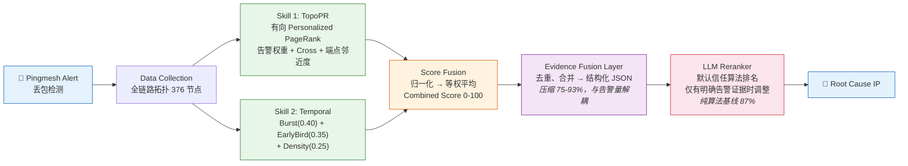
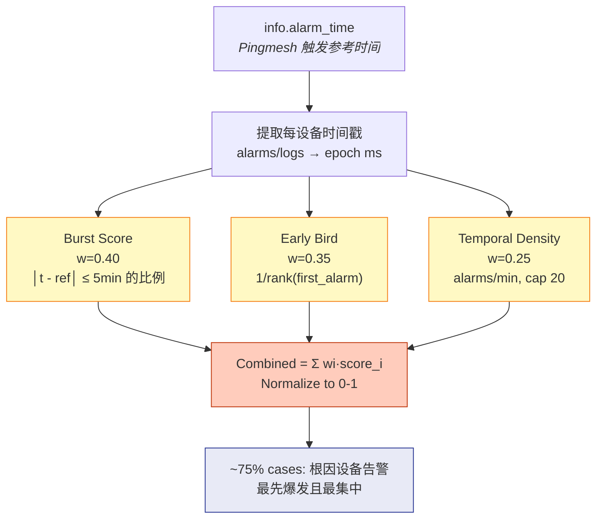
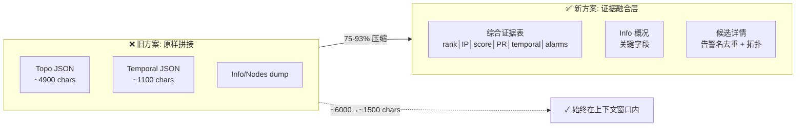

# 方案架构图 — 绘图描述与提示词

---

## 图 1：系统整体架构

### 描述

展示从 Pingmesh 告警触发到最终输出根因 IP 的完整流程。

**七个阶段，从左到右**：

| 阶段 | 内容 | 输入 | 输出 |
|------|------|------|------|
| ① 数据采集 | Pingmesh 拨测发现丢包 → 触发告警 → 拉取全链路拓扑（376节点） | 告警事件 | 全链路 JSON + info.json |
| ② Skill 1: TopoPR | 在有向物理拓扑图上执行 Personalized PageRank，personalization 向量由告警权重 + cross(路径交汇度) + source/sink 邻近度初始化 | 全链路节点列表 | 每设备 [0,1] PR 得分 |
| ② Skill 2: Temporal | 提取每设备告警时间戳，计算 Burst(0.40) + EarlyBird(0.35) + Density(0.25) | 全链路节点列表 + info.alarm_time | 每设备 [0,1] 时序得分 |
| ③ 融合 | 两个信号**逐信号归一化后等权平均**，得到综合分 0-100 | 两个得分向量 | 综合排名列表 |
| ④ 证据融合层 | 将两个 Skill 原始输出压缩为结构化 JSON：topo 字典 + temporal 字典 + combined_score_rankings + devices 详情 | 综合排名 + 原始节点数据 | 三段 JSON 文本 |
| ⑤ LLM 重排 | 默认信任算法排名。仅在候选设备的 high_severity_alarms 提供明确相反证据时调整顺序。告警语义优先级：硬件故障 > 协议中断 > 端口震荡。 | 证据表 + 故障概况 + 候选详情 | 重排后的 IP 列表 |
| ⑥ 输出 | 最终根因 IP（嫌疑从高到低） | — | IP 列表 |

### 关键标注

- Skill 1 和 Skill 2 用**并行的两个分支**表示（左右或上下均可），在"融合"处汇合
- 融合后的综合分标注"纯算法 87% Top-1"
- ④→⑤ 的箭头标注"压缩比 75-93%，大小与告警量解耦"
- ⑤ LLM 节点标注"仅在有告警证据时介入"

### 绘图提示词

```
Draw a system architecture diagram for a data center network root cause localization system.

Flow (left to right, 7 stages):

1. "Pingmesh Alert" (icon: bell/notification) →
2. Two parallel branches (split vertically):
   Upper: "Skill 1: Topology PageRank" - personalized PageRank on directed physical topology. Shows a small network graph icon. Outputs: "Topo Score [0,1]"
   Lower: "Skill 2: Temporal Scoring" - Burst(0.40) + Early Bird(0.35) + Density(0.25). Shows a timeline icon. Outputs: "Temporal Score [0,1]"
3. Branches merge at "Score Fusion" (box): "Normalize → Equal-weight average → Combined Score (0-100)"
4. "Evidence Fusion Layer" (box): "Deduplicate alarms, merge by IP → Structured JSON". Annotate: "75-93% compression"
5. "LLM Reranker" (box with AI/brain icon): "Default: trust combined ranking. Intervenes only when high_severity_alarms provide clear contrary evidence." Annotate: "87% algorithm baseline"
6. "Root Cause IP" (output, terminal/target icon)

Color scheme: blues for data, greens for algorithms, orange for LLM.
Use clean, modern tech-diagram style. Arrows connecting each stage.
Add a small note at the bottom: "Evaluated on 146 manually-labeled DCN failure cases".
```

---

## 图 2：时序 Skill 内部结构

### 描述

展示 Skill 2 (temporal_score_devices) 的三个子特征及其计算流程。

**四个步骤，从上到下**：

| 步骤 | 内容 |
|------|------|
| ① 确定参考时间 | `ref_time = info.alarm_time`（Pingmesh 拨测触发时间） |
| ② 提取时间戳 | 每个设备从 alarms/logs 中提取 `alarm_time` 列表（毫秒级 epoch）。Fallback: label.json 标注设备的告警时间 |
| ③ 三个特征并行计算 | （三列并排） |
| ③a Burst Score | `count(abs(t - ref_time) <= 5min) / total_alarms`。权重 0.40。衡量告警在故障时刻附近的集中度 |
| ③b Early Bird | `1 / rank(device_first_alarm_among_all)`。权重 0.35。衡量设备是否是最早告警的 |
| ③c Temporal Density | `alarm_count / active_span_minutes` (上限 20/min)。权重 0.25。衡量告警的时间密度 |
| ④ 综合 | `score = 0.40*burst + 0.35*early + 0.25*density` → 归一化到 [0,1] |

### 关键标注

- ③ 三个子特征上方标注"每个设备独立计算"
- ④ 处标注"约 3/4 的 DCN 故障中，根因设备的告警最先爆发且最集中 —— 物理规律"
- Burst 节点旁画一个时间轴小图标（告警集中在故障线附近）
- Early Bird 旁画一个排序小图标（第1名）

### 绘图提示词

```
Draw the internal structure of a "Temporal Anomaly Scoring" algorithm used in network root cause analysis.

Top-down flow:

1. TOP: "Reference Time" box: content "info.alarm_time (Pingmesh trigger)"
2. Arrow down to "Extract Per-Device Timestamps" box: "From device alarms/logs → sorted epoch timestamps"
3. Arrow down to THREE PARALLEL COLUMNS:

   LEFT COLUMN (label: "Burst Score - weight 0.40"):
   - "count(|t - ref| ≤ 5min) / total_alarms"
   - Small illustration: timeline with alarm dots concentrated near a vertical "fault line"
   - Text: "Higher = alarms concentrated near fault time"

   MIDDLE COLUMN (label: "Early Bird - weight 0.35"):
   - "1 / rank(device_first_alarm)"
   - Small illustration: podium with #1 highlighted
   - Text: "Higher = device alarmed earliest"

   RIGHT COLUMN (label: "Temporal Density - weight 0.25"):
   - "alarm_count / active_span (cap 20/min)"
   - Small illustration: compact group of dots vs spread-out dots
   - Text: "Higher = denser burst, more root-cause-like"

4. Three columns converge to bottom box:
   "Combined Score = 0.40×Burst + 0.35×Early + 0.25×Density → Normalize to [0,1]"

5. BOTTOM annotation box:
   "In ~75% of DCN failures, root cause devices alarm EARLIEST and MOST CONCENTRATED.
    This is a physical observation, not an algorithmic innovation."

Color: warm orange/amber for temporal features. Clean modern style.
```

---

## 图 3：证据融合层压缩效果

### 描述

并排对比：旧方案（Skill 输出原样拼接）vs 新方案（证据融合层压缩）。

**左侧（旧）**：
- 三个大块：topo 原始 JSON（~4900 字符，含 full_data 重复）、temporal 原始 JSON（~1100 字符）、co_occur 文本
- 下方标注总大小：常规 6057 / 风暴 ~26000 字符
- 一个红色箭头超出边界："超出 LLM 上下文窗口 → 截断/腰斩"

**右侧（新）**：
- 三个小块：综合证据表（IP + 综合分 + PR + 时序 + 告警 + Cross）、故障概况、候选详情
- 下方标注总大小：常规 1526 / 风暴 ~1522 字符（恒定，与告警量解耦）
- 绿色对勾："始终在上下文窗口内"

### 绘图提示词

```
Draw a BEFORE/AFTER comparison diagram showing prompt compression.

LEFT SIDE (BEFORE - marked with red X):
Title: "Raw Skill Output Concatenation"
Three large blocks stacked vertically:
- "Topo JSON (~4900 chars, includes duplicate full_data)"
- "Temporal JSON (~1100 chars)"
- "Info dump + Nodes dump"
Below: "Total: ~6000 (normal) / ~26000+ chars (storm)"
Red arrow pointing off-screen: "Exceeds LLM context window → truncated"

RIGHT SIDE (AFTER - marked with green checkmark):
Title: "Evidence Fusion Layer"
Three compact blocks stacked vertically:
- "Structured Evidence Table (rank|IP|combined_score|PR|temporal|alarms)"
- "Info Summary (key fields only)"
- "Candidate Detail (alarm names + topology, deduplicated)"
Below: "Total: ~1500 chars (constant, decoupled from alarm volume)"
Green checkmark: "Always fits in context window"

Center arrow between left and right: "75-93% compression"

Clean comparison style. Red/green color coding for bad/good.
```

---

## 图 4：消融结果条形图

### 描述

三组条形图，展示消融实验的 Top-1 / Top-3 / Top-5 准确率。

**四组**（从高到低）：
| 组合 | Top-1 | Top-3 | Top-5 | 颜色 |
|------|-------|-------|-------|------|
| [1,2] topo+temporal (llm weights) | 87.41% | 88.81% | 89.51% | 深绿 |
| [2] temporal only | 76.22% | 88.81% | 88.81% | 浅绿 |
| [1,2] topo+temporal (manual weights) | 81.82% | 88.11% | 88.81% | 蓝 |
| [1] topo only | 14-17% | 23-28% | 32% | 灰 |

### 绘图提示词

```
Draw a grouped bar chart showing ablation study results for a network root cause localization system.

X-axis: 4 method combinations (ordered by Top-1 descending)
1. "[1,2] topo+temporal (LLM weights)" - deep green
2. "[1,2] topo+temporal (manual weights)" - blue
3. "[2] temporal only" - light green
4. "[1] topo only (directed)" - gray

Y-axis: Accuracy (%) from 0 to 100.

3 bars per group: Top-1, Top-3, Top-5

Values:
[1,2] llm: top1=87.41, top3=88.81, top5=89.51
[1,2] manual: top1=81.82, top3=88.11, top5=88.81
[2] only: top1=76.22, top3=88.81, top5=88.81
[1] only: top1=17.48, top3=23.08, top5=32.87

Label the tallest bar with "87.41% - Pure algorithm ceiling".
Add annotation arrow from [2] to [1,2]: "+11pp (topo complements temporal on ~13 cases)"

Clean academic style. Legend at top-right.
```

---

## 使用说明

以上提示词可配合 AI 绘图工具生成论文插图。以下 Mermaid 图可直接在 GitHub/GitLab 的 Markdown 中渲染。

---

## 图 1（Mermaid版）：系统整体架构



## 图 2（Mermaid版）：时序 Skill



## 图 3（Mermaid版）：证据融合层压缩



## 图 4（Mermaid版）：消融结果

```mermaid
xychart-beta
    title "Ablation Study: Top-1/3/5 Accuracy (%)"
    x-axis ["[1,2] topo+temporal<br/>(LLM weights)","[1,2] topo+temporal<br/>(manual weights)","[2] temporal only","[1] topo only"]
    y-axis 0 --> 100
    bar [87.41, 88.81, 89.51]
    bar [81.82, 88.11, 88.81]
    bar [76.22, 88.81, 88.81]
    bar [17.48, 23.08, 32.87]
```



## 使用说明

**Mermaid 图**直接嵌入 Markdown，GitHub/GitLab 自动渲染，适合 README 和文档。

**以上英文提示词**可配合 AI 绘图工具（DALL-E、Midjourney、Stable Diffusion）生成论文级插图。建议先按 Mermaid 布局确认结构，再用 AI 工具生成美观版本。
