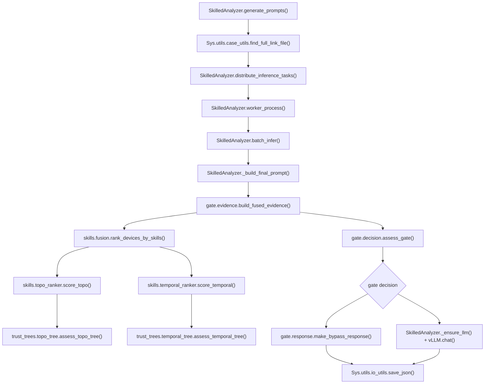
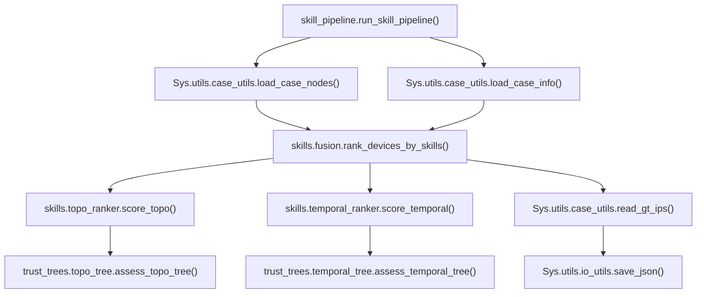

# System Call Graph

This document summarizes the key function path for running one RCA case after
the modularization pass.

## Online LLM Inference

Key idea: `gate.evidence` prepares algorithm evidence for the LLM, while
`gate.decision` decides whether the case should bypass LLM, invoke LLM, or be
sent to operator review.

## Offline Skill Pipeline

The offline path no longer loads dynamic skill files. Skill 1 and Skill 2 are
built-in Python modules under `Sys/RootCauseAnalyze/skills/`.

## Main Modules

| Module | Responsibility |
| --- | --- |
| `Sys/utils/io_utils.py` | JSON, JSONL, CSV, and parent directory helpers |
| `Sys/utils/case_utils.py` | Case file discovery, node/info loading, ground-truth reading |
| `Sys/utils/alarm_utils.py` | Alarm/log name, timestamp, and weight helpers |
| `Sys/utils/ranking_utils.py` | Stable score sorting and score fusion helpers |
| `Sys/RootCauseAnalyze/skills/topo_ranker.py` | Topology PageRank scoring and topo trust evidence |
| `Sys/RootCauseAnalyze/skills/temporal_ranker.py` | Temporal Burst/EarlyBird/Density scoring and evidence |
| `Sys/RootCauseAnalyze/skills/fusion.py` | Runs selected built-in skills and builds combined ranking |
| `Sys/RootCauseAnalyze/skills/provider.py` | Compatibility provider for analyzer code |
| `Sys/RootCauseAnalyze/gate/evidence.py` | Builds LLM-facing evidence from skill outputs |
| `Sys/RootCauseAnalyze/gate/decision.py` | Trust-tree gate routing |
| `Sys/RootCauseAnalyze/gate/response.py` | Score-compatible bypass/operator response |
