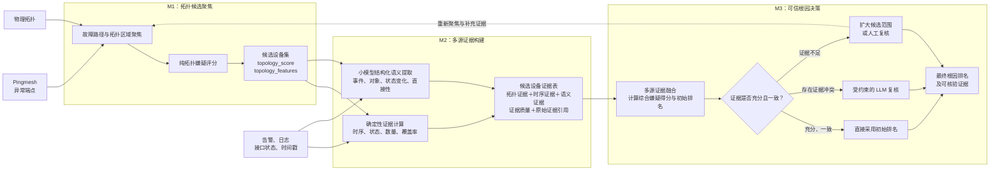

# Pingmesh RCA 三阶段模块重构方案

> 状态：讨论稿，已更新三模块黑盒边界，尚未开始代码重构
> 目的：统一论文叙事、系统接口、消融设计和后续实现顺序

## 1. 背景与重构动机

当前系统的确定性 `pipe` 已经同时包含拓扑排序、时序排序和等权融合，因此论文中的“第一个模块”实际上吸收了大部分有效信号。后续 Gate 主要负责路由，小模型摘要主要负责压缩输入，二者很难在整体 Top-1 上表现出清晰的独立增益。

当前 159 例实验中的代表性结果如下：

| 方法 | Top-1 | Top-3 | Top-5 |
| --- | ---: | ---: | ---: |
| Topology only | 50.31% | 74.21% | 84.28% |
| Temporal only | 62.89% | 88.05% | 94.34% |
| Topology + Temporal | 76.10%～77.36% | 约 85%～90% | 约 91%～94% |
| Gated cached-summary LLM | 78.62% | 91.19% | 91.19% |

最近一次结果中，确定性 `pipe` 为 77.36%（123/159），加入 Gate、小模型摘要和 LLM 后为 78.62%（125/159），整体只净增加 2 个正确案例。这并不表示后续机制没有价值，而是当前模块边界使大量准确率贡献都被计入了第一个模块。

本方案不通过削弱现有方法人为制造消融增益，而是按三个黑盒问题重新划分职责：

1. **M1：哪些设备值得怀疑？**
2. **M2：这些设备分别有哪些可核验的故障证据？**
3. **M3：综合全部证据后，最终应该怀疑谁？**

## 2. 总体系统架构

### 2.1 三模块黑盒定义

系统由三个顶层模块组成：

1. **拓扑候选聚焦（M1）**：使用 Pingmesh 异常端点和物理拓扑生成高召回候选设备集，并输出纯拓扑嫌疑得分。
2. **多源证据构建（M2）**：围绕候选设备收集确定性事实、时序信息和小模型结构化语义，构造候选级证据表。
3. **可信根因决策（M3）**：以证据表为唯一业务输入，在模块内部完成证据融合、可信度分流、选择性 LLM 复核和成本控制，最终输出根因排名。

对外部系统而言，M3 是一个完整黑盒：

```text
候选设备证据表
        ↓
可信根因决策 M3
        ↓
最终根因排名
```

综合嫌疑评分、Gate 路由和 LLM 复核属于 M3 的内部实现，不拆分成新的顶层模块。实现与实验中仍需记录这些内部步骤的中间结果，以支持消融和错误归因。

### 2.2 系统架构图



### 2.3 系统架构图生成 Prompt

以下英文 Prompt 可用于生成论文风格的系统架构插图。图中文字仍使用指定的中文标签，生成后需要人工检查中文、箭头和模块边界。

```text
Create a publication-quality system architecture diagram for a Pingmesh root cause analysis (RCA) system. Use a clean, horizontal, left-to-right vector infographic layout on a white background, with an aspect ratio of approximately 16:9. The visual style should be suitable for a computer networking or software engineering research paper. Use dark blue, teal, and orange to distinguish the three top-level modules. Keep the lines crisp and minimal, and avoid 3D effects, photorealism, gradients, excessive shadows, or decorative elements.

The diagram must contain exactly three large top-level modules with clear and complete black-box boundaries. Keep all figure labels in Chinese exactly as specified below.

Module 1 title: “M1：拓扑候选聚焦”. Its two external inputs are “Pingmesh 异常端点” and “物理拓扑”. Inside the module, show the sequential steps “故障路径与拓扑区域聚焦” followed by “纯拓扑嫌疑评分”. Its output is “候选设备集”, with the smaller annotation “topology_score, topology_features”. Visually emphasize that this module performs high-recall candidate filtering rather than final root cause determination.

Module 2 title: “M2：多源证据构建”. It receives the candidate device set from Module 1 and an additional external input labeled “告警、日志、接口状态、时间戳”. Inside the module, show two parallel branches. The first branch is “确定性证据计算”, with the annotation “时序、状态、数量、覆盖率”. The second branch is “小模型结构化语义提取”, with the annotation “事件、对象、状态变化、直接性”. Merge both branches into “候选设备证据表”, with the smaller annotation “拓扑证据 + 时序证据 + 语义证据 + 证据质量 + 原始证据引用”.

Module 3 title: “M3：可信根因决策”. From the external black-box perspective, this module has one input, “候选设备证据表”, and one output, “最终根因排名”. Inside the module, show “多源证据融合与综合嫌疑评分”, followed by the decision node “证据充分性与一致性判断”. From this node, draw three routes: “充分、一致 → 直接采用初始排名”, “存在证据冲突 → 受约束的 LLM 复核”, and “证据不足 → 扩大候选范围或人工复核”. Merge all three routes into “最终根因排名及可核验证据”. Draw a dashed feedback arrow from “扩大候选范围” back to Module 1, labeled “重新聚焦与补充证据”.

Below the three top-level modules, add one short research question for each module: under M1, “哪些设备值得怀疑？”; under M2, “这些设备有哪些证据？”; under M3, “最终应该怀疑谁？”.

Use a clear Chinese sans-serif typeface. Keep every label horizontal and legible. Make the module titles visually prominent without using overly heavy font weights. Align the three modules at the same height, and make M3 slightly wider to accommodate its three internal decision routes. Use unambiguous directional arrows and consistent spacing. Do not add any unspecified modules, icons, formulas, percentages, English titles, or explanatory paragraphs. Prefer an editable SVG output; otherwise generate a high-resolution PNG.
```

## 3. M1：拓扑候选聚焦

### 3.1 研究问题

> 给定 Pingmesh 异常端点，哪些设备位于值得怀疑的故障传播区域？

### 3.2 职责边界

M1 只负责高召回设备框选和纯拓扑嫌疑评分，不负责最终根因判断。建议使用：

- source/sink 条件化；
- 可行路径或路径走廊；
- cross-path 覆盖；
- 与异常端点的拓扑距离；
- 图中心性；
- 设备角色和上下游关系；
- Top-K 兜底和端点邻域扩展。

M1 原则上不应使用：

- 告警数量；
- 告警语义权重；
- 日志数量；
- 告警时间特征；
- 小模型或主 LLM 输出。

Pingmesh 异常端点本身属于任务输入，不属于告警证据泄漏，可以作为拓扑聚焦种子。

当前 `score_topo()` 的 PageRank personalization 同时使用了告警权重、告警数量和日志。重构时应将这些非拓扑信息移入 M2，并保留纯拓扑版本与 Legacy scorer 作为对照。

### 3.3 候选构造建议

推荐采用并集方案，而不是在 Top-K、路径走廊和邻域扩展之间三选一：

```text
candidate_set =
    feasible_path_corridor
  ∪ endpoint_neighborhood
  ∪ topology_top_k_fallback
```

候选规模可根据拓扑大小自适应设置上限。当前 Topology Top-5 召回率只有 84.28%，不能直接作为后续唯一候选集合。一旦根因在 M1 被过滤，M2 和 M3 都无法自动救回。

M1 的首要指标是 Candidate Recall@K。目标建议在开发集上达到约 98%，同时报告平均、P50 和 P95 候选数量，防止通过无限扩大候选集获得虚假高召回。Top-1 仅作为纯拓扑参考指标。

### 3.4 输出

```json
{
  "candidate_ips": [],
  "topology_scores": {},
  "topology_features": {},
  "feasible_path_evidence": {},
  "candidate_recall_scope": 10
}
```

## 4. M2：多源证据构建

### 4.1 研究问题

> 对于 M1 框选出的每个候选设备，目前能够获得哪些直接、可回溯且时间相关的故障证据？

### 4.2 职责边界

M2 负责把候选设备相关的原始数据转换为统一证据表。它可以生成单项特征或语义证据强度，但不直接输出最终根因排名，也不决定是否调用主 LLM。

M2 包含三个内部步骤：

1. 确定性事实与时序特征计算；
2. 小模型结构化语义提取；
3. 候选级证据归并、质量检查与来源绑定。

### 4.3 确定性事实与时序统计

精确数值必须由程序计算，不交给小模型计算：

- first event offset；
- relative onset rank；
- burst；
- 去重后的 temporal density；
- duplicate ratio；
- 相邻设备之间的 relative lag；
- 故障窗口内和窗口外的事件比例；
- AdminStatus/OperStatus；
- 时间戳、描述和接口字段覆盖率。

示例：

```json
{
  "first_event_offset_ms": -12400,
  "relative_onset_rank": 1,
  "burst_score": 0.82,
  "density_score": 0.36,
  "duplicate_ratio": 0.71
}
```

### 4.4 小模型结构化语义提取

小模型定位为“结构化语义证据提取器”，而不是摘要器、根因分类器或排序器。

建议输入：

- `alarm_name`；
- `alarm_description`；
- 接口名称；
- AdminStatus/OperStatus；
- 原始事件时间戳；
- 设备角色；
- 原始证据编号；
- 程序计算的时序统计。

建议输出事件级严格 JSON。一个原始证据可对应零个或多个结构化事件：

```json
{
  "schema_version": "1.0",
  "parse_status": "success",
  "events": [
    {
      "event_type": "physical_link_down",
      "fault_layer": "physical",
      "object_type": "interface",
      "object": "100GE1/1/25",
      "state_from": "up",
      "state_to": "down",
      "observation_scope": "local",
      "specificity": "direct",
      "lifecycle": "raised",
      "evidence_ids": [0, 1]
    }
  ]
}
```

小模型必须禁止：

- 直接判断某设备是否为根因；
- 输出候选排名；
- 输出未经校准的“根因概率”；
- 编造输入中不存在的接口、设备或事件；
- 自行计算精确时间差和告警数量；
- 输出隐藏思维过程。

语义强度可由程序根据 `event_type`、`fault_layer`、`specificity`、`lifecycle` 等结构化类别进行映射，不建议直接采用小模型自由生成的连续分数。所有字段必须回指原始证据；未解析字段使用 `unknown`，不能自动补全。

### 4.5 候选设备证据表

M2 的核心输出是一行或一组记录对应一个候选设备的统一证据表：

```json
{
  "candidate_ip": "10.0.0.1",
  "topology": {
    "score": 0.73,
    "features": {},
    "path_evidence": []
  },
  "temporal": {
    "features": {},
    "source_evidence_ids": []
  },
  "semantic": {
    "events": [],
    "derived_strength": null,
    "source_evidence_ids": []
  },
  "evidence_quality": {
    "timestamp_coverage": 0.0,
    "description_coverage": 0.0,
    "traceability": 0.0,
    "parse_success": 0.0
  }
}
```

M2 不需要把所有候选压缩成一句摘要。应尽量保留事件级证据编号和结构化事实，使 M3 的排序与复核结果能够回溯。

## 5. M3：可信根因决策

### 5.1 黑盒定义

> 输入候选设备证据表，综合全部证据并控制推理风险，输出最终根因排名。

对外接口为：

```text
evidence_table → trusted_root_cause_decision → final_ranking
```

M3 内部允许包含多个可替换组件，但它们共同服务于一个黑盒目标，不拆分成新的顶层模块。

### 5.2 内部步骤 A：多源证据融合

程序根据 M2 证据表计算综合初始嫌疑分：

```text
preliminary_score = F(
    topology_prior,
    temporal_evidence,
    semantic_specificity,
    temporal_semantic_consistency,
    evidence_quality
)
```

第一版建议优先使用透明、缺失值感知的加权规则或 weighted reciprocal rank fusion。159 例数据直接训练复杂排序模型存在较高过拟合风险；若后续采用可学习融合模型，应使用 grouped cross-validation 或独立开发集完成权重和阈值选择。

LLM 复核之前得到的是“综合初始嫌疑分”和“初始排名”，不能称为最终排名。

### 5.3 内部步骤 B：证据状态与执行动作

M3 根据证据完整性、一致性和候选充分性判断决策状态：

```text
consistent    → 证据充分且相互支持
conflicting   → 强证据指向不同候选
insufficient  → 候选或证据不足以支持自动决策
```

状态与执行动作在内部应分开记录：

```json
{
  "decision_state": "consistent",
  "action": "accept"
}
```

推荐动作包括：

```text
accept             直接采用初始排名
llm_arbitrate      调用主 LLM 复核冲突
expand_candidates  扩大候选并重新构建证据
human_review       转人工复核
```

分类依据可包括：

- Top-1/Top-2 分数间隔；
- 拓扑、时序和语义证据的一致性；
- 时间戳、告警描述和接口状态覆盖率；
- 是否存在直接物理状态变化；
- 候选之间是否存在强证据冲突；
- 候选构造是否达到安全条件；
- 证据引用和小模型解析是否完整。

低分不等于需要调用 LLM。如果问题来自证据缺失或候选召回不足，应扩大候选或人工复核，不能要求 LLM 凭空补足事实。

### 5.4 内部步骤 C：受约束的 LLM 复核

主 LLM 主要处理 `conflicting` 案例，并遵循以下约束：

- 只能在合法候选集合中输出；
- 默认保持 M3 的初始排名；
- 只有明确、可核验的相反证据才能调整顺序；
- 输出 supporting evidence 和 counter evidence；
- 证据不足时显式返回 `insufficient_evidence`；
- 不读取 `label.json`，不访问未进入证据表的隐藏信息。

已有 38 个 LLM 路由案例中，`strong_ranker_conflict` 是最适合保留的 LLM 路由：

| 方法 | 该子集 Top-1 |
| --- | ---: |
| LLM | 68.75% |
| Topology | 50.00% |
| Temporal | 37.50% |

`topo_strong_defer_to_llm` 不应继续无条件调用 LLM，应先判断是否存在结构化语义反证。双弱或候选不足案例也不应直接交给 LLM。

### 5.5 输出

```json
{
  "preliminary_scores": {},
  "preliminary_ranking": [],
  "decision_state": "consistent",
  "action": "accept",
  "llm_review": null,
  "final_scores": {},
  "final_ranking": [],
  "supporting_evidence": {},
  "cost_stats": {}
}
```

## 6. 模块边界与数据流

| 模块 | 允许输入 | 核心输出 | 不承担的职责 |
| --- | --- | --- | --- |
| M1 拓扑候选聚焦 | Pingmesh 异常端点、物理拓扑 | 候选设备、纯拓扑分数和特征 | 告警语义判断、最终根因决策 |
| M2 多源证据构建 | M1 输出、告警、日志、状态、时间戳 | 候选设备证据表 | 最终排名、LLM 路由 |
| M3 可信根因决策 | M2 证据表 | 最终排名、证据引用、决策轨迹 | 原始数据清洗、无约束候选生成 |

最终 `res.json` 建议保存：

```text
topology_candidates
topology_scores
topology_features
evidence_table
preliminary_scores
preliminary_ranking
decision_state
decision_action
llm_review
final_ranking
evidence_sources
cache_version
```

M3 对外是一个黑盒模块，但实验结果不能只保存最终 Top-1。记录内部状态是为了判断证据融合、路由和 LLM 分别修复或破坏了哪些案例，而不是改变顶层模块边界。

## 7. 消融与评价设计

### 7.1 顶层模块评价原则

三个模块的输出类型不同，不能强行要求每个模块都输出 Top-1：

- M1 是候选生成模块，主指标为 Candidate Recall@K 和候选规模；
- M2 是证据构建模块，主指标为事实保真、字段覆盖、解析成功和证据可回溯性；
- M3 是决策模块，主指标为 Top-1、MRR、选择性准确率和调用成本。

纯拓扑得分可以生成参考排名，但 `约 50% → 约 77% → 约 79%` 只能作为端到端配置变化，不应描述为三个模块各自天然输出的同类指标。

### 7.2 当前优先执行的四组简单消融

第一轮只执行以下四组实验，不立即展开 M2 和 M3 的内部组件消融：

| 实验 | M1 | M2 | M3 | 候选范围 | 首版决策分数 | 决策方式 |
| --- | :---: | :---: | :---: | --- | --- | --- |
| M1 | ✓ |  |  | 拓扑排序 Top-K | 拓扑分 | 直接输出拓扑排名 |
| M1+M3 | ✓ |  | ✓ | 拓扑排序 Top-K | 拓扑分 | 置信度评估后直接采用或调用 LLM |
| M2+M3 |  | ✓ | ✓ | 全部设备 | 时序分 | 全设备证据构建和打分后分流，必要时调用 LLM |
| M123 | ✓ | ✓ | ✓ | M1 聚焦的 Top-K | 拓扑分与时序分的平均值 | 完整可信根因决策流程 |

首版融合规则固定为：

```text
M1          : score = topology_score
M1 + M3     : score = topology_score
M2 + M3     : score = temporal_score
M1 + M2 + M3: score = (topology_score + temporal_score) / 2
```

某个实验未启用的评分源不得被计算或传入 Gate。M123 中已启用的拓扑分和时序分严格等权平均，即使某一评分源全为 0，也不能临时退化成单源得分。小模型语义在第一版中作为 LLM 可读证据，不直接进入数值融合，后续再单独讨论语义分的计算方式。

M2+M3 不执行拓扑排序，必须对案例中的全部设备构造证据和计算时序分，因此预计耗时最长。完成全设备初排后，主 LLM 只接收初排 Top-K 的证据，避免上下文长度随全网设备数无限增长；其候选聚焦依据来自 M2 证据分，而不是 M1 拓扑排序。

### 7.3 第一轮消融结果表

| Experiment | Configuration | Correct@1 | Top-1 | Top-3 | Top-5 | MRR | Fix vs M1 | Harm vs M1 | Net Gain | LLM Calls |
| --- | --- | ---: | ---: | ---: | ---: | ---: | ---: | ---: | ---: | ---: |
| M1 | Topology ranking only | 待填/159 | 待填 | 待填 | 待填 | 待填 | — | — | — | 0 |
| M1+M3 | Topology ranking + confidence routing + LLM | 待填/159 | 待填 | 待填 | 待填 | 待填 | 待填 | 待填 | 待填 | 待填 |
| M2+M3 | All-device evidence + temporal scoring + routing + LLM | 待填/159 | 待填 | 待填 | 待填 | 待填 | 待填 | 待填 | 待填 | 待填 |
| M123 | Full three-module system | 待填/159 | 待填 | 待填 | 待填 | 待填 | 待填 | 待填 | 待填 | 待填 |

### 7.4 第一轮消融公平性约束

- 四组实验使用相同的 159 个案例和相同统计分母；
- 所有推理路径均不得读取 `label.json`；
- M1、M1+M3 和 M123 使用同一个纯拓扑评分实现；
- M2+M3 和 M123 使用同一个确定性时序评分实现；
- M1+M3、M2+M3 和 M123 使用同一个 Gate、主 LLM、prompt、温度和随机参数；
- 某组实验缺失输出、LLM 不可用或转人工复核时，不能通过删除该案例缩小分母；
- 每组结果必须记录实际启用的模块、评分源、候选范围、Gate 动作和 LLM 是否真实执行。

### 7.5 后续扩展消融

第一轮完成后，再根据结果决定是否展开以下内部消融：

- M2 w/o temporal；
- M2 w/o small model；
- M2 w/o semantic consistency；
- M3 fusion only；
- M3 without Gate；
- all-case LLM；
- Oracle routing；
- A0 原始事实、A1 无损压缩、A2 小模型结构化语义固定集合对比。

## 8. 评测指标

除 Top-1/Top-3/Top-5 外，还应报告：

- Candidate Recall@K；
- 平均、P50、P95 候选数量；
- MRR；
- `fix`：加入组件后由错变对的案例数；
- `harm`：由对变错的案例数；
- `net_gain = fix - harm`；
- `unique_win`：只有某组件或专家命中的案例数；
- Gate coverage 和 selective accuracy；
- risk-coverage curve；
- LLM corrected/corrupted/unchanged/all-miss；
- prompt token 数、压缩率和推理时延；
- 小模型 schema 解析成功率、事实遗漏率、幻觉率和证据可回溯率；
- 主 LLM 调用比例和每修复一个案例的调用成本。

人工复核、`llm_unavailable` 和空输出不能从全体准确率分母中删除。建议同时报告：

```text
全体自动正确数 / 全体案例数
自动接受案例数 / 全体案例数
自动接受案例正确数 / 自动接受案例数
人工复核或弃权案例数 / 全体案例数
```

159 个案例中，一个案例约等于 0.63 个百分点。77.36% 到 78.62% 实际只增加 2 个正确案例，因此应同时报告案例数，并使用 McNemar 检验或 paired bootstrap 置信区间，避免把 1～2 个案例波动描述成稳定提升。

## 9. 实验公平性要求

- 推理路径不得读取 `label.json`；
- 预测程序只生成无标签预测，独立评测程序再与标签连接；
- 所有阈值和融合权重只能在训练/开发划分上确定；
- 最终测试集冻结候选规则、证据 schema、M3 融合、Gate 和 prompt；
- 相同消融必须使用相同案例和分母；
- LLM 对比必须使用相同主模型参数、温度和随机种子；
- 小模型实验必须使用相同缓存版本和证据组织版本；
- 不得使用旧 143 例、旧 Skill ID 的 `full_ablation/summary.json` 与当前 159 例结果混合比较；
- 数据划分应按故障模板、拓扑、事件来源或等价 group 隔离，避免相似案例跨训练集与测试集泄漏。

在 159 例规模下，优先考虑 grouped cross-validation；如果保留固定测试集，应避免测试集过小，并保证阈值只在训练/开发数据上确定。

## 10. 当前实现中必须先处理的问题

### 10.1 Skill 消融没有真正隔离输入

`SkilledAnalyzer._build_final_prompt()` 接收 `selected_skill_ids`，但当前 `build_fused_evidence()` 内部硬编码：

```python
skill_ids=(1, 2)
```

因此使用 `SkilledAnalyzer.py -s 1` 和 `-s 2` 进行消融时，两组仍可能获得相同的 Topology + Temporal evidence。这类结果不能用于论文结论。

重构时必须将启用的证据源显式传递给 M2 证据构建器，并在结果中记录实际启用的 `evidence_sources`。

### 10.2 Gate 评测缺少实际融合基线

当前 `evaluate_gate_selection.py` 主要比较 Topology、Temporal 和 LLM，没有把 `combined` 纳入逐案例对照；同时 `llm_win_rate` 把 tied-for-best 也计入 win。

后续评测必须针对同一案例统计：

```text
LLM corrected preliminary baseline
LLM corrupted preliminary baseline
LLM unchanged
all methods miss
```

这里的 `preliminary baseline` 应来自 M3 内部冻结的证据融合排名。

### 10.3 不同策略不能使用不同分母

M3 内部策略消融必须保证所有策略在同一组案例上得到明确状态。`llm_unavailable`、人工复核或空输出不能通过缩小有效样本分母使某个策略看起来更准确。

## 11. 建议实施顺序

### 阶段 0：统一逐案例归因与理论上限分析

在修改算法前，先生成统一预测和归因表。预测程序不读取标签；评测程序独立连接 `label.json`。

建议记录：

```text
case_id / group_id / ground_truth
topology_rank / temporal_rank / combined_rank / llm_rank
各候选集合 hit@K
各方法 hit@1
fix / harm / unique_win
decision_state / action / llm_available
evidence_version / cache_version
```

同时计算 Oracle expert selection 上限。如果某个证据源没有 unique win，应优先检查其特征和数据质量，而不是调整消融顺序。

### 阶段 1：实现纯拓扑 M1

- 将当前 Topology scorer 中的告警、日志和时间信号移出；
- 实现路径走廊、端点邻域和 Top-K 兜底的候选并集；
- 输出纯拓扑得分、拓扑特征和候选构造依据；
- 以 Candidate Recall@K 和候选规模为主要评价；
- 保留 Legacy scorer 作为性能对照。

### 阶段 2：实现证据表 M2

- 统一告警、日志、接口状态和时间戳的数据结构；
- 由程序计算确定性时序特征；
- 将摘要器改为结构化语义提取器；
- 增加 `alarm_description`、状态、对象和证据编号；
- 使用严格 JSON schema；
- 缓存只保存最终结构化输出，不保存 `<think>`；
- 评估事实保真率、解析成功率、覆盖率和可回溯率。

### 阶段 3：实现可信根因决策 M3

- 先实现透明、可冻结的证据融合基线；
- 输出初始嫌疑分和初始排名；
- 基于 evidence quality 和证据一致性实现内部 Gate；
- 重点保留 strong conflict LLM 路由；
- 将候选不足与证据冲突明确区分；
- LLM 只在合法候选内进行受约束复核；
- 只在开发集调整权重、阈值和 prompt。

### 阶段 4：完整消融和统计检验

- 运行顶层配置和模块内部组件消融；
- 输出逐案例 fix/harm/net gain；
- 报告准确率、召回、覆盖率、成本和置信区间；
- 根据预先定义的指标判断小模型的准确率贡献和效率收益；
- 冻结论文表格、案例分析和架构图。

## 12. 后续需要继续讨论的问题

1. 路径走廊、邻域范围和 Top-K 兜底的具体组合规则是什么？
2. Candidate Recall@K 的目标采用 95%、98% 还是按候选成本设置约束？
3. M2 小模型 JSON schema 的枚举值和多事件表达如何最终确定？
4. `alarm_description` 的实际覆盖率、模板重复率和文本质量如何？
5. 结构化语义类别到 `semantic_strength` 的映射采用专家规则还是开发集学习？
6. M3 的初始融合采用规则、RRF 还是可校准模型？
7. `consistent/conflicting/insufficient` 的可观测定义和阈值是什么？
8. 人工复核和扩大候选流程是否都需要在当前论文实验中实现？
9. 数据集采用 grouped cross-validation，还是保留独立冻结测试集？
10. 小模型的成功标准如何预注册为保真、准确率和效率三类指标？

## 13. 当前推荐结论

论文与系统统一使用以下三个顶层模块：

1. **拓扑候选聚焦**：使用异常端点和物理拓扑生成高召回候选集及纯拓扑嫌疑得分；
2. **多源证据构建**：围绕候选设备构造包含拓扑、时序、语义、质量和来源信息的证据表；
3. **可信根因决策**：以证据表为输入，在内部完成证据融合、可信度分流和选择性 LLM 复核，输出最终根因排名。

该结构形成清晰的：

```text
候选设备框选 → 候选证据构建 → 最终可信决策
```

M3 虽然内部包含嫌疑评分、路由控制、成本控制和 LLM 复核，但从系统黑盒看只有“证据表输入”和“最终排名输出”，因此不拆分成第四个顶层模块。最终能否形成稳定性能提升，必须在修复消融隔离问题、完成阶段 0 逐案例归因并重新实验后验证。
