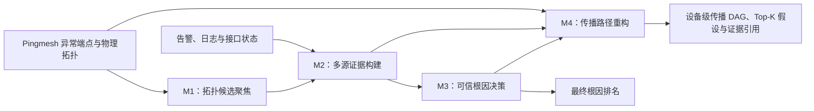
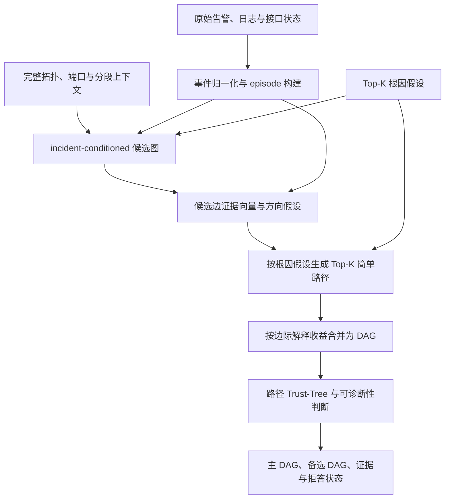

# Pingmesh 故障传播路径重构方案 v0

更新日期：2026-08-11  
状态：设计草案，待接口边界确认后进入 P0 实现

## 0. 设计结论

本方案把新增任务定义为一个独立的传播路径重构模块 M4：

> 给定 incident 的完整拓扑上下文、归一化告警证据和根因候选，输出一个从根因指向症状的、可追溯且显式表达不确定性的设备级传播 DAG，并提供 Top-K 等价传播假设。

已确认并固化的原则：

1. 主输出是**设备级传播 DAG**，告警/日志以事件片段的形式作为节点和边的证据；
2. 传播方向统一为“根因设备或根因链路端点 → 中间传播设备 → 受影响设备/症状”；
3. 首版采用确定性的候选生成、证据打分和图搜索，不直接训练端到端 GNN；
4. 首版 M4 严格位于根因决策之后，不反向修改根因排名，避免循环论证；
5. PageRank 的排序边、原始拓扑链路方向和故障传播方向是三个不同概念，必须分开保存；
6. 无法唯一辨识时输出多个候选 DAG 或拒绝给出唯一图，不强行生成一条线性路径；
7. 路径指标保持可配置，保留原始相似度，并支持公开容忍规则下的 case-level 准确率；
8. 推理代码不读取路径标签，路径标签只进入标注、评估和诊断流程。

## 1. 在现有系统中的位置

### 1.1 目标架构

在三阶段根因定位方案之后增加 M4：



M4 的三个业务输入分别是：

- 完整的 incident 拓扑上下文，而不是只含告警设备的 Top-K 子集；
- M2 产出的事件级证据和证据质量；
- M3 产出的根因候选、作用域和决策状态。

### 1.2 与当前 `Sys` 主链路的兼容方式

在三阶段重构尚未全部落地时，M4 可以通过适配层读取当前产物：

| M4 所需对象 | 当前来源 | 首版适配 |
| --- | --- | --- |
| 根因候选 | `combined_score_rankings`、Gate 最终设备 | 转换为带排名和分数的 root hypotheses |
| 拓扑 | `linked_from`、`linked_to` | 只作为物理邻接并集，不沿用 PageRank 传播方向 |
| 时序事件 | `alarms`、`logs`、`alarm_time` | 去重、归一并生成 episode 和 onset 区间 |
| 语义证据 | `alarm_name`、`alarm_description` | 规则优先，无法解析时使用受约束的本地小模型 |
| source/sink | `info.json` | 映射为端点锚点和影响目标 |

建议首版新增独立 `propagation_pipeline`，将结果写入 `res.json` 的 `propagation` 字段，不改变现有 `skill_ips`、`response` 和 Score_N 评价路径。验证稳定后再把它接入统一推理入口。

## 2. 问题定义

对一个 incident，输入定义为：

```text
I = (G_phy, C_topo, A, R, s, t, t0)
```

其中：

- `G_phy=(V,E_phy)`：设备级物理邻接图；
- `C_topo`：原始 `task_topo.value` 中保留分组、分段、端口、原始链路键和端点锚定信息的拓扑上下文；
- `A`：从告警、日志和接口状态归一得到的 evidence episodes；
- `R`：M3 输出的 Top-K 根因假设；
- `s,t`：Pingmesh source/sink；
- `t0`：Pingmesh 故障参考时间。

输出是按分数排序的传播假设集合：

```text
H = {H1, H2, ..., Hk}
Hi = (root_scope, V_i, E_i, evidence_map, support_score)
```

每个 `H_i` 必须满足：

- 设备边来自物理邻接或输入中可验证的显式逻辑依赖；
- 所有非根节点都能从根节点或根链路端点到达；
- 输出为 DAG；
- 每个选中节点和边都能回指输入证据或拓扑依据；
- 设备、边、接口和事件不得由 LLM 自由补全；
- 不把“拓扑合法”写成“因果关系已经证实”。

## 3. 四类图必须分离

实现中建议使用四个独立对象，禁止复用同一个 `DiGraph` 表达不同语义。

| 图 | 边的含义 | 是否带方向 | 用途 |
| --- | --- | --- | --- |
| 物理邻接图 | 两台设备在输入拓扑中相邻 | 默认无向 | 限制候选传播边是否合法 |
| source→sink 走廊图 | 根据完整拓扑、端点锚点和距离约束计算的可行区域 | 可记录 source→sink 搜索方向，但非因果 | 搜索空间裁剪和 ECMP 候选生成 |
| 排序图 | 使 PageRank 汇聚到疑似上游根因的计算方向 | 有方向 | 根因候选排序 |
| 传播假设图 | 本 incident 中根因到症状的候选影响关系 | 有方向 | M4 最终输出和路径评价 |

当前 `topo_ranker.py` 为根因排序对边进行了反向构造，因此其有向图不能直接传给 M4。M4 只能读取原始物理邻接和单独保存的路径上下文。

## 4. 数据契约补充

### 4.1 必须新增拓扑上下文侧车文件

当前预处理将 `task_topo.value` 中的拓扑分组/分段压缩为 `linked_from/linked_to` 并集，丢失了：

- 分组、分段和 `path_name` 等原始上下文；
- `src_port_name/dst_port_name`、原始链路键和重复链路来源；
- source/sink 是否为设备、外部端点，以及与哪些设备直接相连；
- 原始 `src_ip/dst_ip` 朝向。

已抽查的当前原始样例是“一个大拓扑分段”，不是按跳排列的线性候选路径。因此 P0 不能假设原始数据已经提供真实路径身份或跳序；source→sink 可行走廊和 ECMP 候选必须由 M4 在完整拓扑上计算。

建议预处理额外生成 `topology_context.json`，保持现有 nodes 文件不变：

```json
{
  "schema_version": "topology-context-v1",
  "source_endpoint": "S",
  "sink_endpoint": "T",
  "source_anchors": ["D1"],
  "sink_anchors": ["D5"],
  "topology_groups": [
    {
      "group_id": "GROUP_001",
      "segments": [
        {"segment_id": "SEG_001", "path_name": "ANONYMIZED"}
      ]
    }
  ],
  "edges": [
    {
      "edge_id": "L1",
      "endpoint_a": "D1",
      "endpoint_b": "D2",
      "src_port": "P1",
      "dst_port": "P2",
      "raw_orientations": [{"src": "D1", "dst": "D2"}],
      "group_ids": ["GROUP_001"],
      "segment_ids": ["SEG_001"],
      "raw_link_keys": ["K1"]
    }
  ]
}
```

`endpoint_a/endpoint_b` 只表达物理端点，不表达传播方向。`raw_orientations` 忠实保存输入方向，但除非数据契约明确说明其具有业务方向，否则同样不能直接作为因果方向。外部端点也应保留在 sidecar 中，使 source/sink 能映射到相邻设备；它们不作为设备级传播 DAG 节点。

### 4.2 告警 episode 契约

原始事件先转换为稳定、可去重、可追溯的 episode：

```json
{
  "evidence_id": "E17",
  "raw_evidence_ids": ["RAW_31", "RAW_32"],
  "device_id": "D2",
  "event_type": "physical_link_down",
  "fault_layer": "physical",
  "object_type": "interface",
  "object": "100GE1/1/25",
  "peer_device": "D3",
  "peer_object": "100GE2/1/25",
  "observation_scope": "local",
  "lifecycle": "active",
  "onset_interval_ms": [-300, 200],
  "end_interval_ms": null,
  "parse_method": "rule",
  "parse_status": "success",
  "quality": {
    "timestamp": 1.0,
    "object": 1.0,
    "peer": 0.8,
    "traceability": 1.0
  }
}
```

归一化顺序为：

1. 为每条原始记录分配稳定 `raw_evidence_id`；
2. 统一事件名称、时间单位、设备 ID、生命周期和状态；
3. 抽取接口、peer、local/remote、BGP、LLDP、状态变化和原因；
4. 按 `(device, event_type, object, peer, scope)` 在配置窗口内去重；
5. 配对 active/clear，形成带起止区间的 episode；
6. 保留全部原始证据引用和解析质量，不能只保留摘要。

重复数量作为 `duplicate_count` 特征保存，但不能让告警风暴线性放大边分数。

### 4.3 根因假设契约

M4 不只接收一个设备 IP，而是接收 Top-K 根因假设：

```json
{
  "hypothesis_id": "R1",
  "root_scope": "device",
  "root_devices": ["D2"],
  "root_link": null,
  "rank": 1,
  "support_score": 0.82,
  "decision_state": "consistent",
  "evidence_ids": ["E17"]
}
```

若相邻设备存在可相互核验的接口/对端物理故障证据，可额外构造 `inter_device_link` 假设。它只改变 M4 的根作用域，不反向修改 M3 的设备排名。

## 5. 总体算法流程



首版分为六步：

1. 归一化事件并建立 evidence provenance；
2. 构造与本 incident 相关的候选设备/边；
3. 为每个候选边建立可解释的多维证据向量；
4. 在每个根因假设下定向并搜索 Top-K 传播链；
5. 合并兼容传播链，生成最小解释 DAG；
6. 判断唯一性、证据充分度和是否应输出备选或拒答。

## 6. 候选图构造

### 6.1 节点集合

候选节点采用并集而不是只用某一个 Top-K：

```text
V_candidate =
    feasible_path_corridor(s, t)
  ∪ root_neighborhood(R, h)
  ∪ incident_relevant_event_devices
  ∪ endpoint_anchors
```

其中：

- `feasible_path_corridor` 在 source/sink 锚点间按距离松弛量计算近最短路走廊，而不是枚举稠密图中的全部简单路径；
- `root_neighborhood` 防止根因位于路径边界或拓扑上下文有缺口；
- `incident_relevant_event_devices` 只纳入故障窗口内、语义相关或证据质量足够的设备；
- `endpoint_anchors` 将 source/sink 症状落到网络设备上。

不能只使用 topology/temporal Top-K 的并集，因为真实传播链上的中间设备可能没有任何告警。对任一锚点对，可用以下条件构造走廊：

```text
d(source_anchor, v) + d(v, sink_anchor)
    <= d(source_anchor, sink_anchor) + corridor_slack
```

`corridor_slack`、根因邻域跳数和候选图规模上限必须配置化。当前原始拓扑可能较稠密，禁止枚举全部 source→sink 简单路径。

### 6.2 候选边

候选传播边只能来自：

1. `G_phy` 中的物理相邻设备；
2. 输入证据明确给出的跨设备逻辑依赖，如 BGP peer 或 LLDP remote；
3. 根因链路这一特殊边。

不允许因为两台非相邻设备告警时间相近而直接连边。显式逻辑依赖若跨越物理跳，应标为 `logical_dependency`，不能伪装成物理链路。

### 6.3 症状目标

图搜索不是要覆盖所有告警设备，而是覆盖“本 incident 值得解释的目标”：

- source/sink 对应的接入锚点；
- 故障窗口内具有直接物理/控制面异常的设备；
- 位于 source/sink 可行走廊且语义强度较高的设备；
- 工程上明确指定的受影响对象。

每个目标有独立的 `target_prize` 和证据引用。模板刷量、clear 事件或窗口外事件不能自动成为高价值目标。

## 7. 候选边的证据与定向

### 7.1 边证据向量

每条候选有向边 `u→v` 保存完整特征，不只保存一个黑盒分数：

```json
{
  "from": "D2",
  "to": "D3",
  "edge_type": "physical",
  "features": {
    "topology_valid": 1.0,
    "corridor_support": 0.8,
    "semantic_pair_support": 1.0,
    "temporal_compatibility": 0.7,
    "root_distance_consistency": 1.0,
    "target_coverage_gain": 0.6,
    "evidence_quality": 0.9,
    "contradiction": 0.0
  },
  "support_level": "strong",
  "support_score": 0.84,
  "evidence_ids": ["E17", "E23"],
  "counter_evidence_ids": []
}
```

建议的证据维度：

- `topology_valid`：物理相邻或显式逻辑依赖；
- `corridor_support`：该边是否位于 source/sink 近最短路走廊，以及是否被多个拓扑分组/分段共同支持；
- `semantic_pair_support`：接口对端、local/remote fault、BGP/LLDP、链路状态等是否相互支持；
- `temporal_compatibility`：允许采集延迟和时钟误差后的相对 onset 是否兼容；
- `root_distance_consistency`：是否在当前根因假设下向外传播；
- `target_coverage_gain`：选择该边能新增解释多少高价值症状；
- `evidence_quality`：时间、接口、peer 和 provenance 的完整度；
- `contradiction`：接口不匹配、生命周期冲突、时间严重倒序或更合理的共同上游解释。

在完成路径标注和校准前，输出字段称为 `support_score`，不称为因果概率。

### 7.2 时间兼容性

每个 episode 的 onset 用区间而不是单点表示。若：

```text
onset(u) = [u_min, u_max]
onset(v) = [v_min, v_max]
```

则 `u→v` 的 lag 区间为：

```text
lag(u→v) = [v_min-u_max, v_max-u_min]
```

当该区间与关系类型的允许窗口 `[-epsilon_r, max_lag_r]` 相交时，时间证据兼容。`epsilon_r` 用于容忍告警采集延迟、聚合和时钟漂移。

时间只作为软证据：根因告警不是最早出现时，不能仅据此反转传播方向。

### 7.3 定向优先级

候选边的方向按以下优先级处理：

1. 输入中明确的 local/remote、peer、接口状态或控制面语义；
2. 当前根因假设下的可达性和离根距离；
3. 带容忍区间的 onset/lag；
4. source→sink 距离梯度、原始链路朝向和设备角色，只作为弱先验。

若高优先级证据冲突：

- 同时保留两个方向候选；
- 将其放入同一个 `alternative_group`；
- 由后续图级约束、受限 LLM 或人工复核决定；
- 不得仅按设备角色或最早时间强制定向。

### 7.4 首版支持等级

在未学习权重前，先使用可解释的分层规则：

| 级别 | 最小条件 | 用途 |
| --- | --- | --- |
| strong | 合法邻接 + 明确接口/peer 语义配对，且无强反证 | 可成为主 DAG 骨干边 |
| moderate | 合法邻接 + 语义类型兼容 + 时间区间兼容 | 可进入主 DAG，也触发部分可诊断状态 |
| weak | 只有拓扑、路径走廊或时间接近 | 只进入备选假设，不能单独证明传播 |
| rejected | 拓扑不合法或存在强反证 | 不进入搜索图 |

连续分数的权重、阈值和版本均写入配置。若后续学习权重，只能使用训练/开发标注，不能在测试集上调参。

## 8. DAG 求解

### 8.1 为什么采用“路径搜索 + DAG 合并”

直接求全局最优有向 Steiner 子图或整数规划虽然形式完整，但首版会增加实现复杂度，且目前没有足够路径标签验证目标函数。建议 P0 使用确定性、可审计的两阶段求解：

1. 对每个根因假设和每个症状目标搜索 Top-K 简单路径；
2. 按边际解释收益合并兼容路径，并删除低收益边。

该方法自然支持分支、Top-K 备选和消融，也不会把整张拓扑直接输出。

### 8.2 单链评分

一条候选链不能只累加边分数，否则长链会天然占优或天然受罚。建议同时考虑最弱边、平均边质量、证据覆盖和复杂度：

```text
Q(P) =
    alpha * min_edge_support(P)
  + beta  * mean_edge_support(P)
  + gamma * covered_target_prize(P)
  + delta * grounded_evidence_gain(P)
  - lambda * path_complexity(P)
  - mu    * contradiction_cost(P)
```

公式结构先固定，具体权重不在设计阶段定死。P0 可先用等级排序加稳定 tie-break，确保结果可复现。

### 8.3 DAG 目标

从候选链集合中选择一个紧凑子图：

```text
J(H) =
    covered_symptom_prize
  + selected_edge_support
  + grounded_evidence_gain
  - edge_count_penalty
  - unsupported_branch_penalty
  - contradiction_cost
```

约束包括：

- 每条边属于候选图；
- 每个非根节点至少有一条选中入边；
- 每个选中节点从根集合可达；
- 图中不存在有向环；
- 深度、扇出和图规模不超过配置上限；
- 同一个互斥 `alternative_group` 在单个假设中最多选择一种；
- 不同 incident 的证据不得合并到同一图中。

### 8.4 合并流程

1. 按 `Q(P)` 对候选链排序；
2. 选择第一条能解释最高价值症状的链作为骨干；
3. 依次加入边际收益为正、不会产生环且不会违反互斥组的链；
4. 删除不再贡献症状覆盖或证据覆盖的叶子和边；
5. 对每个节点重新确定 `root/root_endpoint/propagation/affected/uncertain` 角色；
6. 生成主 DAG；
7. 改变根因、方向或 ECMP 分支选择，生成去重后的备选 DAG。

两个候选 DAG 若边集 Jaccard 过高，可视为同一假设，只保留分数更高且证据更完整者。

### 8.5 根因链路和多根因

- 对 `inter_device_link`，求解时添加一个只在内部存在的虚拟超级根，同时连接两个 `root_endpoint`；输出时移除超级根并保存 `root_link` 元数据；
- 对 `multiple_devices`，同样使用虚拟超级根连接各根设备；
- 不允许为了适配单根算法而任意选择根因链路的一端。

## 9. 不确定性与路径 Trust-Tree

M4 使用独立于根因 Gate 的路径 Trust-Tree，不能直接复用根因 Top-1 margin 作为路径置信度。

### 9.1 可诊断性状态

| 状态 | 建议判据 | 输出动作 |
| --- | --- | --- |
| `fully_observed` | 根作用域稳定，关键边均有 strong/moderate 证据，主备假设差距明显，目标覆盖充分 | 输出一个主 DAG |
| `partially_observed` | 图合法但存在 weak 边、未定向边或 ECMP 等价分支 | 输出主 DAG + 备选 DAG + 歧义说明 |
| `unidentifiable` | 只有拓扑先验、根到目标不可达、关键证据缺失或多个假设不可区分 | 拒绝给唯一 DAG，只输出候选范围和缺失证据 |
| `out_of_scope` | 多 incident 混叠或不属于设备/链路传播问题 | 转人工处理 |

### 9.2 Trust-Tree 需要检查的事实

- 根因假设是否存在且在候选图中；
- source/sink 是否能映射为端点锚点；
- 主 DAG 是否拓扑合法、无环、从根可达；
- 每条边是否有 provenance；
- strong/moderate/weak 边占比；
- 高价值症状覆盖率；
- 关键边是否存在方向冲突；
- 主假设与次优假设的结构差异和分数差；
- 时间、描述、接口和 peer 字段覆盖率；
- 是否依赖未告警的中间设备，以及这种依赖是否有完整拓扑走廊依据。

### 9.3 路由动作

```text
accept              直接采用确定性主 DAG
output_alternatives 输出多个等价或近似等价假设
llm_arbitrate       仅在已有候选边之间处理语义冲突
human_review        缺少关键证据或超出任务范围
```

LLM 只能：

- 在候选设备和候选边中选择；
- 判断两条已抽取语义证据是否支持同一关系；
- 给候选边选择已有 relation 类型；
- 输出 supporting/counter evidence ID。

LLM 不能：

- 新增候选图外的设备、接口或边；
- 修改程序计算的精确时间差、拓扑距离和走廊归属；
- 把无证据边提升为 definite；
- 在 `unidentifiable` case 中补写完整传播链。

## 10. 输出 Schema

建议规范化输出如下：

```json
{
  "schema_version": "propagation-output-v1",
  "direction": "root_to_symptom",
  "granularity": "device_with_alarm_evidence",
  "root_hypothesis": {
    "hypothesis_id": "R1",
    "root_scope": "inter_device_link",
    "root_devices": [],
    "root_link": {
      "endpoint_a": "D2",
      "endpoint_b": "D3"
    },
    "source": "m3_plus_explicit_link_evidence"
  },
  "nodes": [
    {
      "device_id": "D2",
      "role": "root_endpoint",
      "onset_interval_ms": [-300, 200],
      "support_level": "strong",
      "evidence_ids": ["E17"]
    }
  ],
  "edges": [
    {
      "edge_id": "P1",
      "from": "D3",
      "to": "D4",
      "relation": "routing_convergence",
      "direction_status": "likely",
      "lag_interval_ms": [100, 1700],
      "support_level": "moderate",
      "support_score": 0.73,
      "evidence_ids": ["E23", "E29"],
      "counter_evidence_ids": [],
      "alternative_group": null
    }
  ],
  "ranked_chains": [
    {
      "rank": 1,
      "devices": ["D3", "D4", "D5"],
      "score": 0.76,
      "covered_targets": ["T1"]
    }
  ],
  "alternative_hypotheses": [],
  "diagnosability": "partially_observed",
  "trust": {
    "state": "partial",
    "passed": ["topology_valid", "root_reachable", "evidence_grounded"],
    "failed": ["unique_hypothesis"],
    "action": "output_alternatives"
  },
  "unresolved_ambiguity": ["ecmp_equivalent_branch"],
  "config_version": "propagation-v0"
}
```

对外展示可以从 DAG 抽取 Top-K 链和自然语言解释，但结构化 DAG 是唯一规范结果，不能再以自由文本中的 `propagation_path` 作为评价输入。

## 11. 评价设计

### 11.1 必须分开两个实验问题

路径重构至少报告两种设置：

1. **Oracle-root reconstruction**：给 M4 工程师标注的正确根因作用域，只评价路径模块本身；
2. **End-to-end reconstruction**：给 M4 当前 M3 的预测根因，评价整个系统。

还应报告 `Path Accuracy | Root Correct`。否则根因定位错误会掩盖路径模块的真实能力，也无法判断改进应发生在 M3 还是 M4。

### 11.2 指标保持插件化

评价器读取同一个输出和标签 schema，支持以下模式：

- `strict`：根作用域、节点、带方向边和顺序完全满足严格真值；
- `component`：Root、Node、Directed Edge、Order、Evidence 分项；
- `top_k`：任一可接受传播假设是否出现在前 K；
- `tolerant`：允许 possible 边、alternative group 和部分可观察 case；
- `rounded_accuracy`：相似度经过统一舍入后按阈值判断 case 正确。

相似度接口可以保留以下分量，但暂不冻结权重：

```text
S(H, G) = Combine(
    S_root,
    S_node,
    S_directed_edge,
    S_order,
    S_evidence
)
```

对多个可接受真值，取：

```text
s_i = max_j S(predicted_i, acceptable_gold_ij)
```

容错准确率为：

```text
correct_i = 1[DecimalRoundHalfUp(s_i, d) >= tau]
TolerantPathAccuracy = sum(correct_i) / N
```

为保证跨语言可复现，舍入应明确采用十进制 `ROUND_HALF_UP`，不要依赖不同语言的默认 `round` 行为。评价结果必须同时保存：

- 未舍入的 `s_i`；
- 舍入后的值；
- `d`、`tau`、分量权重和 matcher 版本；
- 命中的 acceptable hypothesis ID；
- 分项得分和错误类型。

`unidentifiable/out_of_scope` case 不应被迫与一个虚构 DAG 比较，而应单独评价拒答/转人工是否正确。

### 11.3 没有路径标签时

在正式标注完成前，只报告：

- Topology Validity；
- Temporal Consistency；
- Evidence Grounding；
- Root Reachability；
- Observed-impact Coverage；
- DAG Validity；
- 图规模和推理耗时。

这些只能称为有效性和完整性检查，不能称为路径准确率。

## 12. 实验与消融

### 12.1 基线

1. source→sink 锚点之间的拓扑最短路径；
2. 从根因到异常设备的拓扑最短路径并集；
3. 仅按最早告警连接的时序链；
4. 拓扑 + 容忍时序；
5. 拓扑 + 语义配对；
6. 完整 M4：拓扑走廊 + 端口/分段上下文 + 时序 + 语义 + DAG 求解；
7. 受约束 LLM 候选边仲裁，作为完整 M4 的可选增强。

### 12.2 关键消融

- 去掉 source/sink 走廊和原始端口/分段上下文；
- 去掉 episode 去重；
- 去掉接口/peer 语义；
- 去掉相对时间区间；
- 去掉根因 Top-K，只使用 Top-1；
- 强制唯一线性路径 vs DAG + 备选；
- 去掉路径 Trust-Tree；
- predicted root vs oracle root。

### 12.3 分桶

按以下维度报告结果：

- `fully_observed/partially_observed/unidentifiable`；
- 设备根因/链路根因/多根因；
- 单链/分支/ECMP；
- 路径长度；
- 告警量和重复率；
- 物理层/控制面/路由收敛；
- source/sink 锚点是否完整。

## 13. 工程目录与接口建议

建议新增：

```text
Sys/RootCauseAnalyze/propagation/
    schema.py              输出、候选边和配置 schema
    episodes.py            告警归一、去重、active/clear 配对
    topology_context.py    拓扑上下文读取和合法性检查
    candidates.py          incident-conditioned 候选图
    direction.py           边方向与 alternative group
    scorer.py              多维证据和支持等级
    solver.py              Top-K 链和 DAG 合并
    trust.py               路径 Trust-Tree
    reconstruct.py         单 case 统一入口

Sys/RootCauseAnalyze/propagation_pipeline.py
Sys/Score/evaluate_propagation.py
tests/test_propagation_*.py
```

建议单 case 接口：

```python
reconstruct_propagation(
    *,
    nodes,
    info,
    topology_context,
    root_hypotheses,
    evidence_episodes=None,
    config=None,
) -> PropagationResult
```

接口中不接收 `label_path` 或 ground truth。评估器单独读取预测与标签。

## 14. 分阶段实施

### P0：数据契约和确定性骨架

- 生成 `topology_context.json`；
- 建立 evidence ID、episode 去重和基础语义规则；
- 构造候选图和边证据向量；
- 实现 Top-K 简单路径、DAG 合并和结构化输出；
- 实现 validity、grounding 和 DAG 合法性检查；
- 使用人工构造小图完成单元测试。

验收条件：相同输入结果确定；所有边可验证；所有 evidence ID 可回溯；无环；无标签泄漏；证据不足时能拒绝唯一输出。

### P1：5–10 个 case 试标

- 按现有 v0 规范进行双人独立标注和仲裁；
- 检查 definite/possible 边是否可稳定区分；
- 修订事件 taxonomy、关系类型和标注 schema；
- 冻结为 `propagation-label-v1`。

### P2：30–50 个 case 正式实验

- 分层抽样并隔离测试集；
- 调整边权重、Trust-Tree 阈值和 tolerant matcher；
- 运行 oracle-root、end-to-end、基线和消融；
- 报告 bootstrap 95% 置信区间及阈值敏感性。

### P3：受约束 LLM 与工程评审

- 只在语义冲突 case 中启用本地 LLM；
- 比较确定性 M4 与 M4+LLM；
- 统计工程师接受率、边级修改率和复核耗时；
- 决定论文使用“路径还原”还是更保守的“传播假设重构”。

## 15. 首版明确不做的事项

- 不声称恢复真实 ECMP 数据面逐包转发路径；
- 不把每条原始告警建成主图节点；
- 不将 PageRank 边当作传播边；
- 不仅凭“时间更早”认定因果方向；
- 不使用当前 `label.json` 补全中间路径；
- 不让 LLM 自由生成图结构；
- 不在 30–50 个路径标签上直接训练复杂 GNN；
- 不把 topology validity 当作 path accuracy。

## 16. 需要确认的三项设计边界

进入实现前建议确认：

1. **模块关系**：P0 将 M4 固定为 M3 的下游模块，不用传播图反向调整根因排名；联合推理只作为后续消融。
2. **语义抽取**：P0 采用“确定性规则优先 + 本地小模型仅补无法解析字段”，小模型不直接打因果分。
3. **输出策略**：默认输出一个主 DAG；出现 ECMP、边方向冲突或近似等价解时输出 Top-K 备选；只有拓扑弱证据时返回 `unidentifiable`，不强制给路径。

## 17. 与已有文档的关系

- 任务选择、文献和指标候选见 `docs/故障传播路径还原调研.md`；
- 工程师真值定义见 `docs/故障传播路径标注规范_v0.md`；
- M1/M2/M3 的总体边界见 `docs/三阶段模块重构方案.md`；
- 本文负责 M4 的算法、数据契约、输出、评价接口和实施顺序。
