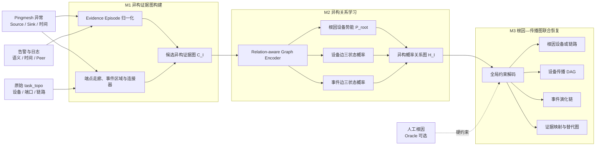

# 基于告警—设备异构关系学习与全局约束解码的 Pingmesh 故障传播图重构方法

> **当前有效方案（2026-08-28）**
>
> 本文唯一主要任务是：**根据 Pingmesh 异常、原始物理拓扑和设备事件，重构以根因为起点、以端到端症状为终点的异构故障传播解释图**。
>
> 根因识别是传播图联合恢复中的源节点推断，不再作为独立的前置排名任务；设备传播 DAG 是主结果，事件演化链和设备—事件关系是证据解释层。此前以 PC-STGR 根因排名、设备级规则边权或根因重排为中心的方案均为历史实现，不定义当前论文结构。

## 1. 论文定位

Pingmesh 能发现 source 与 sink 之间的丢包或时延异常，却不能直接观测故障在数据中心网络内部如何产生、扩散并最终形成端到端症状。一次 incident 只留下物理拓扑、异步告警、设备日志、事件时间和端点异常等间接旁证。

这些观测具有三个根本性质：

1. **部分可观测性**：拓扑上下游、事件时间先后和告警语义都不能单独证明设备间的传播方向；
2. **结构化依赖性**：局部合理的传播边组合后可能形成环、断图或无法解释 Pingmesh 症状；
3. **非唯一可辨识性**：ECMP、告警缺失和时间误差可能使多张传播图产生相同或不可区分的观测。

因此，本文不把最短路、告警共现、时间先后或根因排名直接等同于因果关系，而是先在告警—设备异构图上学习局部概率关系，再通过全局传播约束联合恢复根因与传播图，并在信息不足时输出替代图、部分图或 abstention。

论文主问题为：

> 如何从不完整、异构且仅具有旁证性质的 Pingmesh incident 观测中，学习设备和事件之间的局部概率关系，并在物理拓扑、根可达、症状覆盖和无环约束下，恢复一张全局一致、证据可回溯且能够表达不可辨识性的故障传播图？

## 2. 任务定义

### 2.1 输入

一个 incident 表示为：

```text
I = (G_phy, P, E)
```

- `G_phy`：本 case 的原始 `task_topo`，包括设备、端口、物理链路和原始拓扑边 ID；
- `P`：Pingmesh 异常上下文，包括 source、sink、触发时间、场景和可用的 task trace；
- `E`：故障时间窗口内的告警、日志、状态变化及其时间、接口、peer/neighbor 和本端/远端信息。

主推理设置不要求输入根因。若人工根因 `r` 可用，则将其作为 M3 中的 oracle 约束，用于单独评测传播图恢复能力；它不进入 M2 的局部边关系网络。

### 2.2 输出

主要输出为异构故障传播解释图：

```text
G_prop^het = (
  V_D ∪ V_E ∪ V_S,
  E_DD^prop ∪ E_EE^dep ∪ E_DE^obs ∪ E_DS^impact,
  W, U, T
)
```

节点类型：

- `V_D`：设备节点；
- `V_E`：告警或日志归一化后的 Evidence Episode 节点；
- `V_S`：Pingmesh 症状或端点锚点节点。

边类型：

- `E_DD^prop`：设备到设备的有向故障传播边，是主传播骨架；
- `E_EE^dep`：事件到事件的语义—时间演化边，表达事件依赖而非未经验证的绝对因果；
- `E_DE^obs`：设备与事件之间的观测归属边，用于证据回溯，不属于传播边；
- `E_DS^impact`：设备传播链与 Pingmesh 症状之间的影响解释边。

附加输出：

- `R`：联合识别的根因设备、根因链路或多根集合；
- `W`：根因势能、边状态概率、图得分和边际置信度；
- `U`：替代根因—传播图假设、不确定边和可辨识性状态；
- `T`：节点和边到原始拓扑、告警、日志及时间观测的追溯映射。

### 2.3 任务边界

- 主传播对象是从初始根因到 Pingmesh 症状的前向影响传播过程；
- 设备传播骨架允许分叉和汇聚，但主图为 DAG；
- 后续协议震荡、恢复过程和反馈循环不纳入主设备 DAG，可作为事件层附加现象；
- 不声称恢复真实逐包 ECMP 转发路径，只恢复与当前观测一致的设备级传播解释；
- 设备—事件归属和物理相邻是观测关系，不能直接当作传播因果边；
- 每条 `E_DD^prop` 必须匹配本 case 原始 `task_topo` 中至少一条物理边。

## 3. 方法总览



三个模块构成一条完整主线：

```text
原始旁证
  → 候选异构证据图
  → 根因势能与局部关系概率
  → 全局联合解码
  → 根因 + 设备传播 DAG + 事件证据链
```

## 4. M1：异构证据图构建

### 4.1 Evidence Episode 归一化

以 Pingmesh 触发时间 `t0` 为参照，从相对宽松的事件窗口中读取告警和日志。初始窗口可取 `[t0-10min, t0+5min]`，最终范围只在训练/开发集上确定。

每条原始事件被转换为：

```text
Episode = {
  evidence_id,
  device_id,
  source_type,
  event_name,
  event_type,
  fault_layer,
  object_or_interface,
  peer_device,
  observation_scope,
  onset_interval,
  clear_interval,
  incident_relevance,
  quality,
  raw_reference
}
```

归一化过程包括：

- 同设备、同类型、同对象的重复事件合并；
- raised/clear 生命周期配对；
- 时间戳转换为相对时间和带误差区间；
- 从告警名和描述中提取接口、peer、local/remote 和故障层；
- 区分物理链路、接口、BFD/BGP、路由、配置、设备健康和一般事件；
- 显式保留时间缺失、语义缺失和解析不确定性；
- 为每个 episode 和原始记录建立稳定追溯 ID。

M1 只整理观测，不产生确定传播方向。

### 4.2 节点类型与特征

#### Device 节点

设备特征包括：

- role、device type、degree、端点距离和走廊位置；
- 事件数量、事件类型数、最早/最晚时间及质量统计；
- 是否为 source/sink 网络锚点；
- 端口、peer 和原始物理链路摘要。

#### Event 节点

事件特征由以下部分组成：

- 结构化语义类别与生命周期；
- 相对时间、持续时间和时间有效位；
- 接口、peer、本端/远端及观测质量；
- 告警名的可训练 embedding；
- 冻结的本地中英双语文本表示，经线性层压缩后作为辅助特征。

文本编码器不在小规模 case 标签上端到端微调，外部 LLM API 不参与实验。

#### Symptom 节点

症状节点表示 Pingmesh source/sink 对、端点锚点和需要被图解释的端到端异常，并携带触发时间和场景信息。

### 4.3 输入关系类型

候选异构图中的输入关系包括：

| 关系 | 含义 | 是否为传播真值 |
| --- | --- | --- |
| `D-D physical` | 原始物理相邻 | 否，只限定传播资格 |
| `D-E observed_on` | 事件在设备上观测到 | 否，固定证据关系 |
| `E-E temporal_candidate` | 事件时间可能相继 | 否，候选依赖关系 |
| `E-E semantic_candidate` | 事件语义可能演化 | 否，候选依赖关系 |
| `D-S endpoint/impact_candidate` | 设备与症状端点关联 | 否，候选解释关系 |

### 4.4 候选子图圈定

候选节点由以下部分组成：

1. source/sink 映射得到的网络锚点；
2. 满足 `d(source,v)+d(v,sink) <= d(source,sink)+δ` 的近最短路/ECMP 走廊，初始 `δ=2`；
3. 具有相关 Evidence Episode 的设备；
4. 高相关事件设备的一跳物理邻域；
5. 连接端点、异常区域和必要节点的最短物理连接器。

默认候选节点上限可从 120 起步，在开发集上依据 root recall、传播节点 recall 和物理边 recall 调整。裁剪优先级为：端点锚点、标注根因（仅 oracle 候选覆盖检查）、高相关事件设备、必要连接器、走廊节点、普通邻域节点。

联合推理设置下 M1 不读取根因标签。Oracle 设置可强制补入人工根因及其最小连接走廊，但根因指示位不进入 M2。

### 4.5 M1 输出

```text
C_I = (V_C, E_C, X_V, X_E, Targets, EvidenceMap)
```

该图追求高召回，只定义局部关系学习的搜索空间。

## 5. M2：异构关系学习与概率图构建

### 5.1 编码器技术选型

采用两层轻量 Relation-aware GAT：

- Device、Event、Symptom 使用类型 embedding 和共享投影空间；
- 每类关系使用独立的 relation key/message embedding；
- 两层、每层 4 个 attention head，每头 16 维，总隐藏维度 64；
- 每层包含 residual、LayerNorm 和两层 FFN；
- 只在 M1 候选异构图上编码，控制模型容量和跨区域噪声传播。

对设备 `v` 上的变长事件集合，先采用 incident-conditioned attention pooling 得到事件摘要，再与异构图消息共同更新设备表示。时间已作为事件特征编码，因此集合聚合不依赖原始 JSON 顺序。

### 5.2 根因势能头

只对 Device 节点输出：

```text
q_v = P(root = v | C_I)
```

根因势能利用设备事件、局部拓扑上下文、向外/向内关系倾向和症状解释能力，但不在 M2 中直接选择 Top-1 根因。它只是 M3 联合解码中的节点一元势能。

链路根因可增加独立的 pair/root-link head，为原始物理边输出根因链路势能。

### 5.3 Device—Device 三状态头

对每条物理邻接边 `{u,v}`，预测：

```text
P(u→v), P(v→u), P(No Direct Propagation)
```

使用方向交换等变结构：

```text
s(u→v) = g(z_u, z_v, edge_uv, context)
s(v→u) = g(z_v, z_u, edge_uv, context)
s(none) = g0(z_u+z_v, |z_u-z_v|, edge_uv, context)
```

交换 `u`、`v` 后两个方向分数互换，`No Direct` 分数保持不变。根因标签和根因排名不作为该头的输入。

### 5.4 Event—Event 三状态头

对候选事件对 `{e_i,e_j}`，预测：

```text
P(e_i→e_j), P(e_j→e_i), P(No Dependency)
```

其含义是语义—时间演化关系，不直接宣称绝对因果。输入包括：

- 两事件表示；
- 时间区间差和重叠状态；
- 是否同设备或物理相邻设备；
- 事件层次转换；
- peer、接口和本端/远端证据；
- 与当前 Pingmesh 症状的相关性。

由于现阶段没有可靠的事件依赖人工标签，第一版将事件头作为弱监督/自监督的证据增强模块：使用下一事件预测、时间顺序、语义转换和掩码恢复训练；事件边不进入主路径准确率。获得工程师事件链标注后，再升级为正式监督指标。

### 5.5 训练目标

总体损失为：

```text
L = L_DD + λ_root L_root + λ_EE L_EE + λ_mask L_mask + λ_rel L_relation
```

- `L_DD`：设备传播边三分类主损失；
- `L_root`：case 级根因设备/链路监督；
- `L_EE`：事件演化的弱监督或后续部分标签损失；
- `L_mask`：掩码事件特征恢复；
- `L_relation`：输入关系类型或下一事件关系恢复。

标签状态统一为：

```text
definite / possible / explicit_no_direct / unknown
```

- `definite` 使用硬标签交叉熵；
- `possible` 使用候选标签集合损失 `-log Σ_{y∈S} P(y)`；
- `explicit_no_direct` 是三分类中的确定负类；
- `unknown` 完全屏蔽，不能当作 `No Direct`。

每个 case 的边损失先归一化，再在 case 间平均，避免大图支配训练。采用 incident-grouped 5-fold OOF，同 case 和同事件组不得跨训练/测试。类别权重、早停和超参数只在内层开发集确定。

### 5.6 概率校准

设备边头、事件边头和根因势能头分别在 fold 内开发集执行 temperature scaling。论文同时报告分类指标、Brier Score 和 Expected Calibration Error，确保 M3 使用的是可解释概率而非未校准 logits。

### 5.7 M2 输出

```text
H_I = (
  V_D ∪ V_E ∪ V_S,
  P_root,
  P_DD_state,
  P_EE_state,
  FixedObservationEdges,
  Uncertainty,
  EvidenceMap
)
```

M2 与 M3 之间不进行固定阈值裁剪，保留竞争方向、预测熵和反证。

## 6. M3：根因—传播图联合恢复

### 6.1 技术选型

采用 CP-SAT/整数约束优化求解一个带节点奖励的有向传播子图选择问题。候选图经过 M1 裁剪，适合使用显式布尔变量表达边选择、根因选择、症状覆盖和 DAG 顺序。

### 6.2 优化变量

- `x_uv ∈ {0,1}`：是否选择设备传播边 `u→v`；
- `a_ij ∈ {0,1}`：是否选择事件演化边 `e_i→e_j`；
- `z_v ∈ {0,1}`：设备是否进入传播图；
- `y_v ∈ {0,1}`：设备是否为根因；
- `y_uv^link ∈ {0,1}`：物理链路是否为根因链路；
- `c_t ∈ {0,1}`：是否覆盖症状目标 `t`；
- `o_v`：设备 DAG 的拓扑顺序变量。

### 6.3 优化目标

```text
maximize
  Σ x_uv · log[(P(u→v)+ε)/(P_DD_none+ε)]
+ λ_EE Σ a_ij · log[(P(e_i→e_j)+ε)/(P_EE_none+ε)]
+ λ_R Σ y_v · root_logit(v)
+ λ_T Σ w_t · c_t
+ λ_G · evidence_grounding
- λ_size · selected_edge_count
- λ_bridge · topology_bridge_count
- λ_root · root_count
- λ_conflict · temporal_semantic_conflict
```

权重只在开发集选择。相对 `No Direct` 的 log-odds 避免大量未选边常数项支配目标。

### 6.4 设备传播骨架约束

1. 选中设备边必须匹配原始 `task_topo`；
2. `x_uv + x_vu <= 1`；
3. 传播边两端设备必须被激活；
4. 根因设备无传播入边；
5. 被选中的非根设备至少有一个上游传播入边；
6. 所有选中设备沿入边可回溯到某个选中根因；
7. 设备主传播图满足 DAG 顺序约束；
8. 图至少覆盖一个有效 Pingmesh 症状目标；
9. 在解释能力接近时优先选择更紧凑、证据更强的图。

设备传播骨架允许汇聚，即非根设备可有多个上游边；它不是强制树。

### 6.5 事件证据层约束

- 事件演化方向必须与时间区间兼容，除非明确记录时间不确定；
- 每个选中事件必须通过固定 `observed_on` 边归属于设备；
- 支持某条设备传播边的事件应位于该边两端设备或明确 peer 对象上；
- 事件演化链不得仅依赖告警共现；
- 事件层负责解释设备传播骨架，不得凭空创建设备物理传播边。

### 6.6 两种根因设置

#### Oracle-root reconstruction

输入工程师根因并固定根因变量，只评价设备传播 DAG 和证据链恢复，隔离根因识别误差。

#### Joint root-graph reconstruction

不输入根因，由根因势能、设备边概率、事件证据和症状覆盖联合选择 `R` 与 `G_prop^het`。默认先评估单根模式，再通过根因数量惩罚扩展到多根并发事件。

链路根因通过虚拟根节点连接链路两端设备，避免强行把物理链路故障归到某一端。

### 6.7 替代图与可辨识性

求得最优解后，通过 no-good cut 排除相同根因与边集合，继续求取 Top-K 近优假设，默认 `K=5`。根据截断图后验计算：

- 根因边际概率；
- 设备边/事件边选中边际概率；
- 主图与次优图得分差；
- 图假设熵；
- 稳定核心边；
- 症状覆盖率和桥接边比例。

输出三种状态：

- `identifiable`：根因和关键设备边在近优解中稳定；
- `partially_identifiable`：核心传播骨架稳定，但根因、分支或事件链存在替代解释；
- `unidentifiable`：多组根因—传播图无法区分，或主要依赖无证据桥接。

不可辨识时输出稳定局部图、替代假设或 abstain，不强制给出唯一完整路径。

## 7. 标注方案

### 7.1 主标注对象

每个 case 至少标注：

- 根因设备、根因链路、多根或不确定；
- 设备节点的 `definite / possible / excluded / unknown`；
- 设备传播边的方向与 `definite / possible / explicit_no_direct / unknown`；
- 可接受的替代设备传播图；
- case 的可辨识性；
- 关键边对应的原始告警、日志和拓扑证据；
- 标注置信度和仲裁说明。

### 7.2 事件层标注

第一阶段不要求工程师穷举所有事件依赖边。优先标注：

- 与根因直接对应的 initiating events；
- 支持关键设备传播边的事件对；
- 明确的物理故障 → 协议变化 → 路由变化 → Pingmesh 症状链；
- 明确无关或并发事件。

未标事件对默认为 `unknown`，不得作为 `No Dependency`。当事件标注规模和一致性足够后，再把事件边升级为正式监督任务。

### 7.3 标注完整度

每个 case 需要保存 `annotation_complete_scope`。只有工程师声明某个候选边集合已被完整检查时，该范围内未选择的边才可转为 `explicit_no_direct`；否则未标边全部是 `unknown`。

## 8. 训练与推理边界

- 推理不得读取 `label.json`、根因标签或传播图标签；
- M2 的 OOF 评测按 case/incident group 划分，边不能跨 fold 泄漏；
- 自监督预训练只能使用当前外层 fold 的训练 case；
- 最终全量模型只能用于后续未见 case，不能回代生成论文分数；
- 阈值、候选图规模、损失权重、概率温度和解码权重只在开发集确定；
- 外部 LLM API 不参与实验；冻结文本编码器或本地模型必须记录版本；
- 物理拓扑方向、事件时间方向和故障传播方向必须严格分离。

## 9. 评价方案

### 9.1 主设置

1. **Oracle-root heterogeneous propagation reconstruction**：固定人工根因，评价传播图与证据层；
2. **Joint root-graph reconstruction**：不输入根因，联合评价根因与传播图；
3. **Multi-root extension**：只在明确并发或多根标注子集上评价。

Oracle 设置用于方法分解，联合设置是最终端到端任务。论文主结论仍以传播图质量为中心，而不是单独的根因 Top-K。

### 9.2 主指标

设备传播骨架：

- Node Precision、Recall、F1；
- Directed Device-edge Precision、Recall、F1；
- Device-edge State Macro-F1；
- exact graph match 与预先定义的 tolerant match；
- 路径顺序一致性；
- topology validity、root reachability 和 DAG validity。

联合根因：

- Root device/link accuracy；
- Root Top-K、MRR；
- Joint root-and-graph exact/tolerant match；
- 固定正确根因与联合根因之间的图质量下降。

证据与不确定性：

- Evidence Grounding Rate；
- Initiating-event coverage；
- 关键设备边的事件证据认可率；
- identifiability classification；
- coverage-risk 与 selective accuracy；
- probability calibration、Brier Score 和 ECE。

没有传播图标注时，拓扑合法率、DAG 比例、时间兼容率、证据回溯率和图规模只能作为诊断指标，不能报告为路径准确率。

### 9.3 基线

- 端点间最短路径；
- k-shortest/ECMP 走廊；
- 仅时间定向的设备拓扑图；
- 拓扑 + 时间规则图；
- 设备级边模型，不使用 Event 节点；
- 异构编码后逐边 argmax，不使用全局解码；
- 先固定根因 Top-1 再解码的硬串联系统；
- Oracle-root 全局解码上界；
- 现有根因定位方法与最短路径的组合，仅作为端到端基线。

### 9.4 消融

- 去掉事件语义或冻结文本表示；
- 去掉时间区间，只保留事件计数；
- 去掉 peer/接口/本端远端关系；
- 去掉 Relation-aware 编码，改为 device-only encoder；
- 去掉自监督预训练；
- 去掉 `No Direct/No Dependency` 状态；
- 去掉根因势能，只从图源节点推断根因；
- 去掉事件演化得分；
- 去掉全局 DAG、根可达或症状覆盖约束；
- 去掉替代图与 abstention；
- 不同候选走廊 slack、邻域半径和图规模。

## 10. Challenge 与创新点

### C1：Latent Propagation Inference from Circumstantial Evidence

传播边不可直接观测，拓扑、时间和语义都只是旁证。M1 与 M2 将这些异构观测统一为告警—设备图，并学习设备传播与事件演化的概率关系。

### C2：Globally Consistent Reconstruction from Locally Uncertain Relations

局部边概率可能冲突、成环或无法解释症状。M3 通过物理合法、根可达、症状覆盖和 DAG 约束联合恢复根因与传播图。

### C3：Identifiability under Observational Equivalence

不同根因—传播图可能产生相同观测。Top-K 近优图、边际稳定性和 abstention 用于区分唯一、部分和不可辨识 case。

对应的预期创新点为：

1. **面向 Pingmesh 的异构传播解释图任务**：同时输出设备传播骨架、事件演化链和证据归属关系；
2. **共享异构表示上的局部关系学习**：利用少量独立 case 内密集的设备、事件和关系，在 case 级无泄漏条件下学习根因势能与三状态边概率；
3. **根因—传播图联合约束恢复**：根因不是硬前置排名，而是传播图源节点变量，与设备边、事件链和症状覆盖共同优化；
4. **面向观测等价的可辨识性输出**：显式返回稳定核心图、替代假设和 abstention。

最终创新表述必须以标注集实验、工程师一致性和消融结果为依据。

## 11. 当前实现差距

现已完成一个无需外部根因输入、可端到端运行的异构 V0。V0 用于验证数据
接口、图 schema 和完整推理闭环，不等于最终的学习模型与精确优化器。

| 新方案能力 | 当前状态 |
| --- | --- |
| Evidence Episode 归一化 | 已有规则原型，可复用并扩展 |
| 原始 `task_topo` 与端口边 ID | 已有，可复用 |
| 设备级候选走廊 | 已有，并被 V0 复用 |
| Device/Event/Symptom 异构图 | 已完成 V0：类型化节点、物理/归属/症状/事件候选关系 |
| Relation-aware GAT | 历史 PC-STGR 有关系感知编码思路，但未实现为当前联合模型 |
| Device—Device 三状态监督头 | 现有规则/softmax 原型可作为基线，需重做为异构神经头 |
| Event—Event 三状态头 | 已完成时间—语义启发式 V0；正式学习头未实现 |
| 根因势能与边关系共享异构表示 | 已完成可解释一元势能 V0；共享学习表示未实现 |
| 根因—传播图联合解码 | 已完成单设备根因有界枚举 V0；CP-SAT、链路根因和多根未实现 |
| 异构解释输出 | 已完成设备 DAG、事件链、证据归属、替代根图与基础 identifiability 输出 |
| 异构传播图标注与正式评测 | 未实现；当前自动测试只验证 schema、拓扑合法、DAG 和退化行为 |

`Sys/RootCauseAnalyze/propagation/`、`stage1/` 和现有 `stage2/m1/m2` 字段只用于原型复用、基线和历史结果重现，不定义当前论文模块名称。

## 12. 当前优先级

1. 在服务器完整数据上运行异构 V0，统计失败 case、候选图规模、空事件、原始拓扑覆盖和运行时间；
2. 冻结异构传播图标注 schema，特别是 `possible / explicit_no_direct / unknown`；
3. 选择 10–20 个代表 case 双人试标并仲裁，验证设备边和事件链的可标注性；
4. 验证 M1 候选图的 root/node/edge recall；
5. 完成 M2 的 grouped OOF 设备边三分类和根因势能评测；
6. 先跑通 oracle-root M3，再进行联合根因—传播图恢复；
7. 完成设备路径基线、异构图消融、Top-K 替代图和典型 case 可视化；
8. 最后扩展多根并发和正式事件依赖监督。

## 13. 论文结构建议

1. 绪论：Pingmesh 能检测异常，但内部传播过程不可见；
2. 相关工作：网络故障诊断、异构事件图、传播/因果图、结构化图解码；
3. 问题定义：异构传播图、观测关系、传播关系和可辨识性；
4. 方法：M1 异构证据图、M2 关系学习、M3 联合图恢复；
5. 实验：标注集、边关系、oracle/joint 图结果、基线、消融和案例；
6. 讨论：ECMP、告警缺失、事件边语义、多根故障和泛化边界；
7. 总结。
