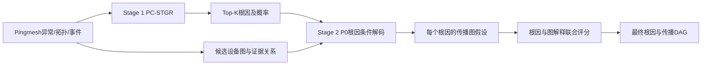

# 基于根因排序与传播约束解码的 Pingmesh 故障传播图恢复方法

> **当前有效方案（2026-09-02）**
>
> 本文主要任务是恢复故障传播图。系统先训练 PC-STGR 完成根因候选排序，再在 Top-K 根因条件下使用 P0 恢复设备级故障传播 DAG。P0 是当前论文方案；P4是使用传播图标注训练的优化模型；P1退出当前实验矩阵。

## 1. 研究问题

Pingmesh 可以发现 source 与 sink 之间的丢包或时延异常，但不能直接给出数据中心网络内部的故障起点和影响传播过程。一次 incident 只留下物理拓扑、设备告警、日志、事件时间和端点症状等旁证。

本文回答两个顺序相关的问题：

1. 哪个设备最可能是当前 incident 的根因？
2. 给定一个候选根因，异常如何沿物理拓扑传播并最终解释 Pingmesh 症状？

根因定位是传播图恢复的前置任务，但不能只向第二阶段传递 Top-1。错误 Top-1 会使后续图恢复不可逆地失败。因此，Stage 1 输出带概率的 Top-K 根因，Stage 2分别恢复根因条件传播图，再结合图解释质量完成最终选择。

## 2. 任务定义

### 2.1 输入

一个 incident 表示为：

```text
I = (G_phy, P, E)
```

- `G_phy`：原始 `task_topo`，包含设备、端口、物理链路和拓扑边 ID；
- `P`：Pingmesh source、sink、异常时间、场景和可用 trace；
- `E`：故障窗口内的告警、日志、状态变化、接口和 peer 信息。

### 2.2 中间输出：根因排序

```text
R = [(r_1,p_1), (r_2,p_2), ..., (r_K,p_K)]
```

其中 `r_k` 是候选根因设备，`p_k` 是该设备在当前 case 内的根因概率。当前系统默认向图恢复阶段传递 Top-5。

### 2.3 最终输出：根因条件传播图

```text
O = (r*, G_prop, A, U)
```

- `r*`：最终选择的根因设备；
- `G_prop=(V_prop,E_prop)`：从根因指向异常症状的设备传播 DAG；
- `A`：边的原始拓扑 ID、告警和事件证据；
- `U`：替代根因—传播图假设和诊断状态。

本文恢复的是与观测一致的设备级传播解释图，不声称恢复真实逐包 ECMP 转发路径。

## 3. 总体流程



统一运行入口：

```bash
bash scripts/run_full_experiment.sh
```

## 4. Stage 1：PC-STGR 根因定位

### 4.1 候选图

PC-STGR 将候选设备、设备事件、物理邻接、异常端点路径位置和事件时间顺序构造成 Device–Event 时空图。

### 4.2 编码与评分

模型使用关系感知图编码器得到设备表示，对每个候选设备输出一个根因 logit：

```text
z_v = RootMLP(h_v)
p_v = softmax_case(z_v)
```

当前单根因训练目标为 case 内交叉熵：

```text
L_root = -log p_y
```

每个 case 是一个监督单元，设备节点不能被视为跨 case 独立样本。

### 4.3 输出与评测

Stage 1 输出 Top-K 根因列表。论文报告：

- Top-1、Top-3、Top-5 Accuracy；
- MRR；
- Top-K candidate recall；
- grouped OOF 结果。

所有自监督预训练、词表构建、早停和超参数选择必须限制在当前外层 fold 的训练数据中。

## 5. Stage 2：P0 故障传播图恢复

### 5.1 P0 的方法定位

P0 是本文当前主方法。它不使用传播图标签训练传播边模型，而是将局部告警、时间、语义和设备关系证据转化为可审计的传播支持度，再在根因和全局结构约束下恢复传播 DAG。

### 5.2 根因无关的局部证据图

首先在原始物理拓扑上为每个相邻设备对 `{u,v}` 建立三种状态：

```text
u → v
v → u
No Direct Propagation
```

正反方向证据包括：

- case 内告警支持度；
- 事件时间顺序；
- 告警语义关联；
- 接口、peer 和本端/远端关系；
- routing convergence 或 physical link 关系；
- 反向时间和语义矛盾。

无直接传播证据来自设备无活动、缺失动态关系或显式不支持状态。

P0 直接归一化正向、反向和无传播支持：

```text
[P(u→v), P(v→u), P(no-direct)]
    = normalize([s_uv, s_vu, s_none])
```

### 5.3 根因条件化

对于 Stage 1 的每个候选根因 `r_k`，在候选物理图上计算设备到根因的最短距离。传播边必须满足：

```text
d(r_k,v) > d(r_k,u)
```

即只允许异常影响沿根因向外传播。候选边还必须满足方向传播概率高于 `No Direct`，且达到最低支持阈值。

### 5.4 传播路径搜索与 DAG 合并

针对每个 Pingmesh 症状目标搜索根因到目标的高支持路径。路径得分综合：

- 路径最弱边支持；
- 路径平均边支持；
- 症状目标权重；
- 证据绑定比例；
- 路径长度复杂度；
- 时间或语义矛盾。

每个目标选择最优路径，并将路径合并为设备传播 DAG。

### 5.5 硬约束

1. 所有传播边必须对应原始 `task_topo` 物理边 ID；
2. 同一物理对最多选择一个传播方向；
3. 根因没有传播入边；
4. 非根传播节点必须可沿入边回溯到根因；
5. 传播骨架必须无环；
6. 图应覆盖至少一个有效 Pingmesh 症状；
7. 无法满足条件时允许回退、部分图或不可诊断状态。

### 5.6 根因—图最终评分

P0 为 Top-K 根因分别产生图假设，并计算图解释分数。最终得分为：

```text
S_final(r_k,G_k)
  = α · normalized_root_score(r_k)
  + (1-α) · normalized_explanation_score(G_k)
```

当前 `α=0.5`，只能在开发集选择。若传播证据不足，系统回退到 Stage-1 排序。

## 6. P4：有监督传播边优化

P4 使用已完成的传播图标注训练三分类边模型。它和 P0 共享候选图、根因条件路径搜索与 DAG 解码器，仅替换局部边概率生成方式。

### 6.1 标签

- `definite/possible`：有方向传播正例；
- `explicit_no_direct`：无直接传播负例；
- `unknown`：屏蔽，不能当作负例；
- `acceptable_hypotheses`：评测时允许的替代传播图。

### 6.2 当前模型

P4 当前采用类别加权多项逻辑回归，输入正反方向的时间、语义、直接关系、矛盾、证据数量、关系类型、无活动支持和方向支持差等特征。

训练采用 incident-grouped OOF。每个外层 fold 内再划分训练集和开发集，用于：

- 早停轮次选择；
- temperature scaling；
- 传播方向最低概率阈值；
- 传播方向相对 `No Direct` 的最小概率余量。

边接纳规则为：

```text
p_dir ≥ τ
p_dir - p_none ≥ δ
p_dir = max(p_forward, p_reverse)
```

`τ` 和 `δ` 在 fold 内开发集上以 directional F0.5 选择，优先抑制导致传播图膨胀的假阳性边。P4优化结果必须重新运行 OOF 后报告，不能沿用修改前结果。

## 7. P0、P4与历史方法

| 方法 | 边概率来源 | 是否训练 | 当前角色 |
| --- | --- | --- | --- |
| P0 | 正向、反向、无传播证据直接归一化 | 否 | 本文主方法 |
| P4 | 传播图标注训练的三状态分类器 | 是，grouped OOF | 优化实验 |
| P1 | 固定权重 Logit/Softmax | 否 | 已退出，不再运行或报告 |
| 异构 V0 | 内部根势能与启发式异构关系 | 否 | 历史原型 |

## 8. 传播图标注与无泄漏要求

传播图标注已经完成，使用 `heterogeneous-propagation-label-v1`，包括根因、设备节点、DD 边、可接受替代图、标注完整范围和证据追溯。

实验必须遵守：

- 推理不得读取根因标签和传播图标签；
- PC-STGR 使用 grouped OOF 根因预测；
- P4 对有标签 case 使用对应外层 fold 模型；
- 阈值、温度、早停和权重只能在 fold 内开发集确定；
- 最终全量模型只用于后续未见 case，不能回代生成论文分数；
- `unknown` 关系始终屏蔽；
- 原始物理拓扑边、告警证据和传播推断必须分开记录。

## 9. 统一评价

### 9.1 Root Location

统一汇总同时保留两组根因指标：

1. Stage-1 PC-STGR OOF：Top-1、Top-3、Top-5、MRR；
2. Graph Rebuild 后：最终 root accuracy、Top-1、Top-3、Top-5、MRR。

### 9.2 Graph Rebuild

- Directed-edge Precision、Recall、F1；
- Node Precision、Recall、F1；
- Strict Exact Rate；
- 可选 tolerant accuracy；
- topology validity；
- DAG valid rate；
- root reachable rate；
- mean edge count、症状覆盖和证据绑定率。

设备边和节点指标采用 case-macro。默认在预测和标签两侧执行 `evidence_free_exact_structural_twins_v1` 等价投影，同时保留关闭聚合的原始指标选项。

### 9.3 统一产物

`run_full_experiment.sh` 默认运行 P0 和 P4，不再运行 P1。顶层产物为：

- `summary.json`：`root_location` 与 `graph_rebuild` 两个指标域；
- `summary.csv`：每个方法一行，根因与传播图指标位于同一表；
- `summary.md`：可直接阅读和粘贴的统一指标表；
- `propagation/p0/selected_propagation_paths.json`：论文主方法传播图；
- `propagation/p4/selected_propagation_paths.json`：P4优化传播图；
- `evaluation/p0.json`、`evaluation/p4.json`：逐 case 及聚合评测。

## 10. 当前实验结果与口径

以下是 P4优化前的207个 case结果，只用于确定当前方法角色；P4修改后必须重新运行：

| 方法 | Root Accuracy | Directed-edge P/R/F1 | Node P/R/F1 | Strict Exact |
| --- | ---: | ---: | ---: | ---: |
| **P0** | 75.36% | 65.42% / 67.03% / **60.78%** | 77.93% / 80.17% / **74.09%** | **47.34%** |
| P4（优化前） | 76.33% | 13.13% / 75.26% / 18.84% | 24.67% / 92.66% / 33.64% | 0.00% |

P0 在传播图主指标上显著优于优化前 P4，因此以 P0 作为本文方案。P4仅略微提高根因准确率，但传播图假阳性严重；当前优化目标是提高边和节点精确率、恢复严格完全匹配，并在 grouped OOF 下验证是否超过 P0。

## 11. 后续实验

1. 重新运行统一脚本，验证P4保守阈值对边数、Precision、Recall和Exact Match的影响；
2. 增加 Oracle-root 设置，隔离根因排序错误与传播边恢复错误；
3. 统计每个 case 的预测边数/标注边数比和 P4 `No Direct` 混淆矩阵；
4. 对 P0 与 P4进行根因 Top-K、最低边支持、最大路径深度和结构等价消融；
5. 在单设备根因主任务稳定后，再扩展链路根因和多根并发。
