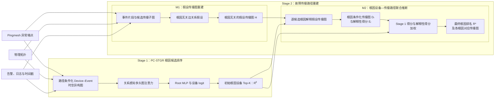

# 基于事件条件化时空异构图排序与传播路径联合推断的 Pingmesh 故障诊断方法

> **2026-08-18 Stage 1 设计更新：**本轮已确定下一版 Stage 1 目标结构为
> **PC-STGR（Path-Conditioned Spatio-Temporal Graph Ranker）**。PC-STGR 使用
> Device–Event 图、路径条件特征、固定 2 维节点类型 one-hot、16 维事件名称
> Embedding、`42→64` 节点编码、两层关系感知多头注意力以及单根因 case 内
> Softmax 交叉熵。完整决策、特征表、网络图、向量变化和迁移要求见
> [`PC-STGR设计方案.md`](./PC-STGR设计方案.md)。当前 Stage 1 代码已经迁移到
> PC-STGR，但尚未完成新的 grouped OOF。本文下方的 IC-STGR 结构和 159-case
> 指标仅记录历史状态；不得把这些 checkpoint 或指标改名为 PC-STGR 结果。

## 1. 论文定位

本文面向数据中心网络中的 Pingmesh 异常事件，联合解决两个问题：

1. 统一建模异常时序、告警和网络拓扑，对根因设备进行高召回候选排序；
2. 重建根因无关的假设传播图，并评价各根因设备对该图的解释能力。

论文目标方案采用两个 Stage：

- **Stage 1：PC-STGR（Path-Conditioned Spatio-Temporal Graph Ranker）根因候选排序**；
- **Stage 2：故障传播路径重建**。

本文已经选定 **PC-STGR** 作为下一版 Stage 1 目标方法。PC-STGR 将设备、事件、物理拓扑、异常端点路径位置和事件时间顺序构造成 Device–Event 图，通过关系感知多头注意力输出设备级根因 logit。其完整特征、关系、维度、损失和迁移要求以 [`PC-STGR设计方案.md`](./PC-STGR设计方案.md) 为准。

PC-STGR 是本项目方法名，不是直接复现某一篇同名论文。论文的贡献口径应放在 Pingmesh 场景下的 **路径条件化 Device–Event 图、显式时空关系和 case 内单根因排序适配**，不声称提出全新的通用注意力机制。当前 Stage 1 代码已经实现 PC-STGR；已完成 OOF 的 IC-STGR 仅作为迁移前历史结果，不能改名作为 PC-STGR 实验结果。

Stage 1 生成初始根因 Top-K。Stage 2 再划分为两个核心模块：

- **M1：假设传播图重建**，输出一张根因无关的假设传播图；
- **M2：根因设备—传播路径联合推断**，评价各候选根因对该图的解释性，并输出根因排序及相应传播图。

这里的 M1、M2 仅表示 Stage 2 内部的两个方法模块，不再用于指代两个 Stage。

## 2. 总体架构



端到端流程为：

```text
原始观测
  → Stage 1：构造路径条件化的 Device–Event 时空异构图
  → 关系感知图注意力编码与 Root MLP，生成初始根因 Top-K
  → Stage 2 / M1：重建一张根因无关的假设传播图 H
  → Stage 2 / M2：评价每个候选根因对 H 的解释性
  → 加权 Stage 1 证据得分与 Stage 2 解释性得分
  → 输出最终根因排名及各根因对应的传播图
```

## 3. Stage 1 历史实现：IC-STGR 根因候选排序

> 本节记录迁移前已经实现并完成 OOF 的 IC-STGR，用于解释现有代码、
> checkpoint 和 159-case 指标。它不是 PC-STGR 目标规格；新的实现决策、
> 网络输入和损失必须以 `PC-STGR设计方案.md` 为准。

### 3.1 历史技术状态与阶段目标

迁移前的已实现模型为 **IC-STGR**。给定 Pingmesh 异常端点、物理拓扑和故障窗口内的告警事件，模型输出高召回、带学习分数的根因候选列表：

```text
R⁰ = [(r1, s1), (r2, s2), ..., (rK, sK)]
```

Stage 1 回答：

> 根据异常发生时间和告警在拓扑中的空间分布，哪些设备最可能是根因？

根因标签只用于训练和离线评价；推理时不读取 `label.json`，也不依赖外部 LLM。固定 checkpoint 和推理配置后，同一输入产生可复现的排名。Stage 1 的核心目标是尽可能将真实根因保留在 Top-K 中，为 Stage 2 提供候选空间和根因先验，而不是独立完成最终 Top-1 裁决。

### 3.2 Incident 条件化时空异构图

每个 case 构造一张 Device–Event–Incident 异构图：

| 节点类型 | 含义 | 主要信息 |
| --- | --- | --- |
| Device | 候选根因设备 | 设备角色、拓扑位置、异常统计和端点相关性 |
| Event | 故障窗口内的告警/日志事件 | 事件类型、相对时间、状态和所属设备 |
| Incident | 当前故障的全局条件节点 | Pingmesh 异常端点、参考时间和 case 级上下文 |

图中使用 10 类有向关系：物理拓扑正向/反向、Event→Device/Device→Event、设备内时间 next/previous、跨设备事件 earlier/later，以及 Incident→Device/Device→Incident。边的作用是限定“谁向谁传递哪一类消息”，并选择对应关系的参数和注意力权重；边本身不会直接查表得到根因 logit。

### 3.3 关系感知图注意力与根因 logit

节点数值特征投影、节点类型 embedding 和事件 token embedding 相加得到初始表示 `h_v⁰`。第 `l` 层中，目标节点 `v` 对相邻源节点 `u` 计算共享 Query/Key/Value，并将关系类型 embedding 与边特征投影加入 Key、Value 和注意力偏置：

```text
q_v = W_Q h_v
k_u,r = W_K h_u + Emb_K(r) + W_EK x_u→v
m_u,r = W_V h_u + Emb_V(r) + W_EV x_u→v

α_u→v,r = softmax((q_v · k_u,r) / √d + b_r + b_E(x_u→v))
h_v' = Update(h_v, Σ_r Σ_u α_u→v,r · m_u,r)
```

当前默认配置为隐藏维度 64、4 个注意力头、2 层关系感知图编码器。多头机制不是“每种边对应一个头”，而是每个头可以在同一批关系上学习不同的关注模式。经过消息传递后，只取 Device 节点表示，由 Root MLP（Multi-Layer Perceptron，多层感知机）映射为标量根因 logit：

```text
z_r = MLP_root(h_r)
p(r | incident) = softmax({z_i})_r
R⁰ = TopK_r p(r | incident)
```

因此，训练会同时更新节点编码、关系/边特征 embedding、注意力参数，以及 Device 表示到 logit 的 Root MLP；并不是只学习一个固定的“边→logit”函数。

### 3.4 多正例排序损失

一个 case 可能有多个可接受根因。设候选设备集合为 `V`，正例集合为 `P`，模型 logit 为 `z_i`，主损失采用多正例 listwise 目标：

```text
L_list = -log(Σ_{p∈P} exp(z_p) / Σ_{i∈V} exp(z_i))
```

再从非根因设备中选 logit 最高的 `K_hard=16` 个困难负例 `N_hard`，加入 pairwise 间隔项：

```text
z_P = log((1 / |P|) · Σ_{p∈P} exp(z_p))
L_pair = mean_{n∈N_hard} softplus(z_n - z_P)
L = L_list + 0.2 · L_pair
```

`L_list` 让正例集合获得更高的总概率质量，`L_pair` 直接压低最容易混淆的负例。训练按验证集 MRR 选择最佳 epoch。

### 3.5 训练、推理与输出契约

论文主结果采用按 case 分组的 5-fold out-of-fold（OOF）评价：每一折只用其余折训练并预测当前折，最终合并全部未见样本预测。全量标签训练得到的 `final_model.pt` 仅用于后续无标签推理，不能作为论文已标注数据上的评分结果。

```json
{
  "initial_root_rankings": [
    {
      "rank": 1,
      "ip": "device_a",
      "combined_score": 0.79,
      "neural_score": 0.79,
      "logit": 2.31
    }
  ],
  "stage1": {
    "method": "incident-conditioned-spatiotemporal-heterograph-v1",
    "evaluation_mode": "out_of_fold"
  }
}
```

### 3.6 已有实验结果与论文口径

当前 159 个 case 上的可比结果如下；IC-STGR 必须报告 OOF 分数：

| Stage 1 方法 | 评价方式 | Cases | Top-1 | Top-3 | Top-5 | 论文角色 |
| --- | --- | ---: | ---: | ---: | ---: | --- |
| 确定性拓扑+时序融合 | 确定性全量推理 | 159 | **77.36%** | 89.94% | 94.34% | 强白盒基线 |
| **IC-STGR** | 5-fold OOF | 159 | 73.58% | **93.71%** | **97.48%** | 历史已实现神经基线 |

准确的结果表述是：相较确定性基线，IC-STGR 的 Top-1 下降 3.78 个百分点，但 Top-3、Top-5 分别提高 3.77、3.14 个百分点；Top-5 漏召回从 9 个 case 降到 4 个，减少 55.6%。IC-STGR 有 38/159 个 case 的真实根因位于第 2–5 名，因此当前证据支持“提高候选召回、为后续候选消歧提供空间”，不支持“已经提高 Stage 1 Top-1 准确率”的表述。

主要评价指标：

- Top-1、Top-3、Top-5 Accuracy；
- MRR；
- Candidate Recall@K；
- 平均、P50、P95 候选规模；
- 单 case 推理时间。

### 3.7 历史实验计划与迁移边界

下表记录 PC-STGR 决策之前的 IC-STGR 实验计划，不再作为当前迁移清单。当前必做实验以 `PC-STGR设计方案.md` 第 16–17 节为准：

| 方法/实验 | 简要说明 | 当前状态 | 结果控制 |
| --- | --- | --- | --- |
| **IC-STGR** | Incident 条件化异构图；显式建模 Device、Event、Incident 与时空关系，直接学习设备排序 | 已完成首轮 OOF；历史实现 | 73.58 / 93.71 / 97.48 |
| 确定性拓扑+时序融合 | 人工规则和统计量的白盒强基线 | 已完成 | 77.36 / 89.94 / 94.34 |
| LambdaMART | 对设备级时空统计特征进行树模型 learning-to-rank；特征值可自动批量计算，但特征定义、窗口、聚合和缺失值口径仍由研究者指定 | 待实验；强学习排序基线 | 待填，不预设提升 |
| Device-only GAT/GCN | 只在设备图上传播聚合特征，用于检验 Event/Incident 异构建模的必要性 | 待实验；结构基线 | 待填，不预设提升 |
| IC-STGR 去跨设备时间边 | 删除 `earlier/later` 关系，衡量显式跨设备时序的贡献 | 待实验；消融 | 待填，不预设提升 |
| IC-STGR 去 Incident 节点 | 删除全局条件节点，衡量 incident 条件化的贡献 | 待实验；消融 | 待填，不预设提升 |
| IC-STGR 损失与采样优化 | 比较 listwise、pairwise 权重、困难负例数、类别/排名校准和多随机种子稳定性 | 待实验；主线优化 | 待填，不预设提升 |

历史结果中使用“学习式”或“非透明”描述 IC-STGR。目标论文主方法改为 PC-STGR 后，必须用 PC-STGR 自身 OOF 结果回答路径条件化、事件语义和显式时空关系是否带来更高候选覆盖；不得沿用本节 IC-STGR 指标作答。

## 4. Stage 2：故障传播路径重建

### 4.1 阶段目标

Stage 2 首先由 M1 根据本次事件的拓扑和异常证据重建一张不预设根因的假设传播图：

```text
H = (V_H, E_H)
```

随后，M2 将 Stage 1 Top-K 中的每个候选根因代入同一张图 `H`，评价该根因对图中传播关系和异常观测的解释性，并导出该根因对应的传播图 `D_r`：

```text
(r1, H) → (E1, D1)
(r2, H) → (E2, D2)
...
(rK, H) → (EK, DK)
```

Stage 2 回答：

1. 不预设根因时，本次故障可能激活了哪些传播关系？
2. 每个候选根因能够在多大程度上解释这张假设传播图？
3. 在给定候选根因时，与其对应的故障传播图是什么？

### 4.2 M1：假设传播图重建

M1 的职责是只根据本次事件的拓扑、时序和告警证据，生成一张根因无关的假设传播图 `H`。M1 不为不同根因分别生成图，也不负责根因排序。

#### 4.2.1 事件片段与候选传播子图

将原始告警和日志归一为可追溯的 evidence episodes，并在完整 incident 拓扑上构造联通候选子图。节点集合包括：

- Pingmesh source/sink 近最短路走廊；
- 存在有效异常事件的设备；
- 连接异常设备、端点走廊和异常区域所需的中间设备。

M1 不读取 Stage 1 的候选列表、名次或分数。异常目标集合在 M1 中统一确定，供 M2 的所有候选根因共同解释。若某个 Stage 1 候选不在假设传播图中，M2 将其视为只能解释零跳自身事件或无法解释传播关系，而不是让 M1 围绕该候选重新构图。

#### 4.2.2 根因无关的边关系假设

为避免“先假定根因，再用该假定生成的路径证明根因”的循环论证，M1 首先不读取 Stage 1 名次和候选根距离。拓扑只限定待分析的物理相邻设备对；每条边的概率只由时间先后、告警语义和直接关联三类证据赋值：

```text
A → B
B → A
No Direct Propagation
```

边关系证据包括：

- **时间先后证据**：带容忍区间的异常先后关系，分别支持 `A→B` 或 `B→A`；
- **告警语义证据**：事件类型组合支持某个传播方向，语义无关时支持“不直接传播”；
- **直接关联证据**：告警或日志明确描述本端/远端、peer 或 neighbor 设备关系，支持相应传播方向。

#### 4.2.3 假设传播图输出

M1 将候选子图中的边关系组织为一张统一的带权假设传播图：

```text
H = (V_H, E_H, A, evidence_map)
```

其中：

- `V_H`：本次故障涉及的候选设备和必要连接设备；
- `E_H`：每条物理相邻边上的 `A→B`、`B→A` 和“不直接传播”三状态概率；
- `A`：所有候选根因共享的异常目标集合；
- `evidence_map`：节点和边到原始告警、日志和时间证据的映射。

`H` 可以包含分叉、环形竞争关系、双向候选和方向不确定边，它是一张传播关系假设图，不是某个根因条件下的最终传播 DAG。M1 的规范输出只有一张 `hypothesis_graph`。

### 4.3 M2：根因设备—传播路径联合推断

M2 接收 Stage 1 根因候选及其证据得分，以及 M1 输出的同一张假设传播图 `H`。对于每个候选根因 `r`，M2 完成：

1. 以 `r` 为起点，在 `H` 上选择方向一致、从根可达且无环的传播子图 `D_r`；
2. 评价 `r` 对 `H` 中传播关系和统一异常目标集合的解释程度；
3. 输出一个归一化的解释性得分 `S_explain(r | H)`；
4. 将 `S_explain` 与 Stage 1 证据得分加权，生成最终排序。

最终排序公式只保留两个分量：

```text
S_final(r) =
    α · Normalize(S_stage1(r))
  + (1 - α) · Normalize(S_explain(r | H))
```

其中：

- `S_stage1` 是 Stage 1 模型输出的设备根因分数；目标 PC-STGR 由设备 logit 经 case 内 softmax 得到，历史 IC-STGR 结果仅用于迁移前联调；
- `S_explain` 是候选根因对假设传播图的单一解释性得分；
- `α ∈ [0,1]` 控制初始证据和传播解释的相对作用。

解释性得分采用“可解释的有效传播关系权重占比”：

```text
S_explain(r | H) =
    Σ(e ∈ D_r) w(e)
    ───────────────
    Σ(e ∈ E_H⁺) w(e)
```

其中，`E_H⁺` 是 M1 输出的有效候选传播关系，`D_r` 是在“从 `r` 可达、方向兼容、无环”约束下选出的根因条件传播图。这个比值越高，表示根因 `r` 能解释的假设传播关系越多、证据权重越强。

拓扑合法、根可达、方向兼容和 DAG 无环作为构造 `D_r` 的硬约束，不再进入最终排序加权。若需使用异常目标覆盖率，可将其作为解释性得分是否有效的最低门槛，而不增加第三个排序分量。

M2 按联合分数生成最终根因排名：

```text
R* = SortDescending({S_final(r) | r ∈ R⁰})
```

反向改写规则为：

- 解释性得分较高的候选可以提升，解释性得分较低的候选可以下降；
- 假设传播图缺少有效传播关系时，令 Stage 2 不参与重排，回退 Stage 1 排名；
- 同时保存初始排名、最终排名及 `promote/demote/unchanged`；
- `consistent/challenged/contradicted/insufficient_evidence` 可作为解释状态，但不引入额外排序公式。

最终根因以 `R*` 的 Top-1 为准。M2 同时输出每个候选根因对应的传播图 `D_r`，并将最终 Top-1 对应的 `D_r` 作为主故障传播图。

### 4.4 Stage 2 输出契约

```json
{
  "initial_root_rankings": [],
  "hypothesis_graph": {},
  "final_root_rankings": [
    {
      "rank": 1,
      "ip": "device_b",
      "initial_rank": 2,
      "stage1_score": 0.73,
      "explanation_score": 0.88,
      "final_score": 0.81,
      "rank_change": "promote"
    }
  ],
  "selected_root": "device_b",
  "selected_propagation_graph": {},
  "root_conditioned_propagation_graphs": [],
  "ranking_feedback": {
    "ranking_rewritten": true,
    "fallback_to_stage1": false
  },
  "unresolved_ambiguity": [],
  "schema_version": "two-stage-output-v1"
}
```

### 4.5 Stage 2 评价

#### M1 假设传播图重建

有传播关系标注时，评价 M1 输出的统一假设传播图：

- Active relation Precision、Recall、F1；
- Directed-edge Precision、Recall、F1；
- 方向歧义与共同原因状态识别；
- Evidence Grounding。

没有传播关系标注时只能报告拓扑合法性、时间兼容性、证据回溯率和图规模，不能称为路径准确率。

#### M2 联合推断与根因条件传播图

分开两个设置：

1. **Oracle-root reconstruction**：输入真实根因，只评价该根因对应传播图；
2. **Predicted-candidate reconstruction**：输入 Stage 1 Top-K，评价解释性排序和端到端路径能力。

路径部分报告：

- Node Precision、Recall、F1；
- Directed-edge Precision、Recall、F1；
- 路径顺序一致性；
- Top-K path accuracy；
- 图级 exact/tolerant match。

根因排序部分至少比较：

- Stage 1 初始排名；
- Stage 1 + M1 假设传播图，但不启用解释性重排；
- 完整 Stage 1 + Stage 2。

报告：

- 重排前后 Top-1/Top-K 和 MRR；
- `fix`：错误 Top-1 被改正确的案例数；
- `harm`：正确 Top-1 被改错误的案例数；
- `net gain = fix - harm`；
- promote、demote、unchanged 比例；
- 正确根因不在 Stage 1 Top-K 时的不可恢复案例数。

#### Stage 2 内部消融

- 最短路径 vs 假设传播 DAG；
- 仅拓扑 vs 拓扑+时间 vs 拓扑+时间+语义；
- 去掉共同原因和方向歧义；
- 去掉统一目标集约束；
- 仅 Stage 1 得分 vs 仅解释性得分 vs 两者加权；
- 不同 `α` 的敏感性分析；
- Top-1 单根假设 vs Top-K 多根比较；
- 关闭 M2 传播反馈重排。

## 5. 层级边界与删减结果

| 原有概念 | 新设计中的位置 | 是否单列核心模块 |
| --- | --- | --- |
| 时序排序器 | Stage 1 的历史白盒基线及 PC-STGR 时间关系参照 | 否 |
| 拓扑排序器 | Stage 1 的历史白盒基线及 PC-STGR 空间关系参照 | 否 |
| 确定性证据融合 | 强基线，不再作为论文 Stage 1 主方法 | 否 |
| LambdaMART | 学习排序强基线，用于检验人工指定特征模式的上限 | 否 |
| IC-STGR | 已实现并完成 OOF 的历史神经版本 | 否，迁移参考 |
| PC-STGR | Stage 1 的目标主方法 | 是，Stage 1 核心方法 |
| 多源证据表 | 拆入 PC-STGR 图特征和 Stage 2/M1 episodes | 否 |
| 传播路径重构 | Stage 2/M1 假设传播图重建 | 是 |
| 根因一致性与反证 | Stage 2/M2 联合推断 | 是 |
| 根因排名反向改写 | Stage 2/M2 联合推断 | 是，核心机制 |
| 小模型候选摘要 | 从核心链路移除 | 否 |
| 主 LLM 仲裁 | 可作为扩展对照，不是必要推理环节 | 否 |

因此，论文顶层是两个 Stage，编号模块只出现在 Stage 2。目标论文的 Stage 1 统一称为 PC-STGR，不再把旧的时序/告警—拓扑分支或兼容层中的 Skill 包装成并列论文模块。

## 6. 预期创新点

### 创新点 1：面向 Pingmesh 的路径条件化 Device–Event 时空图根因排序

将异常端点锚点、端点距离和路径走廊直接写入 Device 特征，在 Device–Event 图上使用显式物理、事件归属和时间关系进行关系感知消息传递，并以 case 内单根因 Softmax 交叉熵形成高召回的初始根因候选。创新点是 Pingmesh 路径条件、事件级时空建模与排序任务适配，而不是宣称提出新的通用注意力算子。

### 创新点 2：根因无关关系建模与多根假设传播图重建

先建立一张不依赖候选根距离的统一假设传播图，减少由预设根因带来的循环论证。

### 创新点 3：根因设备—传播路径联合推断

评价各候选根因对同一假设传播图的解释性，并将单一解释性得分与 Stage 1 证据得分加权，输出根因排序及相应传播图。

## 7. 论文结构建议

1. 绪论：Pingmesh 能检测异常，但根因位置和传播过程仍不可见；
2. 相关工作：DCN 故障定位、拓扑/时序 RCA、传播图重建；
3. 问题定义与方法总览：Stage 1 和 Stage 2；
4. Stage 1：PC-STGR 路径条件化 Device–Event 图、关系感知编码与单根因排序；
5. Stage 2：M1 假设传播图重建与 M2 根因—路径联合推断；
6. 实验：初始排序、路径重建、根因重排、消融与案例分析；
7. 局限与总结：路径可辨识性、告警缺失、ECMP 歧义和数据边界。

## 8. 当前实现映射

| 新架构 | 当前实现 |
| --- | --- |
| Stage 1 PC-STGR 图构造 | `Sys/RootCauseAnalyze/stage1/neural_graph.py` |
| Stage 1 PC-STGR 编码、排序头与单根因损失 | `Sys/RootCauseAnalyze/stage1/neural_model.py` |
| Stage 1 PC-STGR OOF 与无标签推理入口 | `Sys/RootCauseAnalyze/stage1/neural_pipeline.py` |
| 当前 PC-STGR 论文实验入口 | `scripts/run_paper_05_pc_stgr.sh` |
| Stage 1 确定性强基线 | `Sys/RootCauseAnalyze/stage1/temporal_ranker.py`、`alarm_topology_ranker.py`、`fusion.py`、`pipeline.py` |
| Stage 2/M1 事件片段 | `Sys/RootCauseAnalyze/propagation/episodes.py` |
| Stage 2/M1 候选传播子图 | `Sys/RootCauseAnalyze/propagation/candidates.py` |
| Stage 2/M1 边关系 | `Sys/RootCauseAnalyze/propagation/scorer.py` |
| Stage 2/M1 边概率赋值 | `Sys/RootCauseAnalyze/propagation/m1/probability.py` |
| Stage 2/M1 假设传播图输出 | `Sys/RootCauseAnalyze/propagation/m1/reconstruct.py` |
| Stage 2/M2 根因条件化传播图 | `Sys/RootCauseAnalyze/propagation/solver.py` |
| Stage 2/M2 解释性评价与加权排序 | `Sys/RootCauseAnalyze/propagation/m2/infer.py` |
| Stage 2 总编排 | `Sys/RootCauseAnalyze/propagation/reconstruct.py`、`propagation_pipeline.py` |
| Stage 2 评测 | `Sys/Score/evaluate_propagation.py` |

当前接口边界已经拆分：PC-STGR 输出 OOF 或无标签推理的 `initial_root_rankings`；M1 独立输出一张根因无关的 `hypothesis_graph`；M2 输出每个根因的 `explanation_score`、对应传播图和 `final_root_rankings`。当前 PC-STGR 实现保持了该 Stage 1 输出契约，最终排序仍只采用 Stage 1 得分与解释性得分两个加权分量。

## 9. 研究边界

- 推理过程不得读取根因或路径真值；
- 历史 IC-STGR 分数和未来 PC-STGR 主表分数都必须来自各自的 OOF 预测，不能使用全量标签训练 checkpoint 对同一批 case 的回代结果；
- 不声称恢复真实 ECMP 逐包转发路径，而是重建与观测一致的传播假设；
- PageRank 计算方向、物理拓扑方向和故障传播方向必须分离；
- 时间先后只是传播证据之一，不能单独等价为因果关系；
- Stage 2 只能重排 Stage 1 保留的根因候选，Candidate Recall@K 决定端到端上限；
- 所有融合权重、阈值和重排规则只能在训练/开发集上确定；
- 初始排名、最终排名、名次变化和路径证据必须同时保存；
- 数据预处理、缓存等工程环节不包装成额外论文 Stage 或 Module。
